# CertiFit Backend Design

Last audited: 2026-06-14 — intelligence layer fully implemented.

This is the canonical backend system design document. Keep it current after every completed feature. A new engineer or AI agent should be able to continue backend work from this file without first spelunking the repository.

## Project Overview

CertiFit is an MVP recruiting backend for matching candidates to recruiter-owned jobs. It currently supports:

- Recruiter and candidate authentication.
- Recruiter-owned jobs.
- Candidate-owned resume profiles.
- Candidate applications.
- Gemini-backed resume and job-description parsing.
- Deterministic match scoring.
- Alembic migrations.

Planned MVP expansions include GitHub ingestion, LinkedIn PDF ingestion, normalized profile generation, trust scoring, and interview copilot support.

## MVP Goals

Current MVP goals:

- Candidates can upload a resume, maintain a candidate profile, apply to jobs, and view their applications.
- Recruiters can create jobs, manage only their own jobs, and view applications for their own jobs.
- Candidate profile data is private to the owning candidate except when exposed through an application to a recruiter-owned job.
- Ranking is deterministic and explainable for MVP.
- Shared databases use Alembic, not `create_all()`.

Out of scope for current MVP unless explicitly requested:

- Teams.
- Companies table.
- Recruiter profiles.
- Notifications.
- Interview tables.
- Embeddings or vector search.
- Multi-tenant organizations.

## Implementation Status

| Area | Status | Notes |
| --- | --- | --- |
| Auth | ✅ Implemented | JWT bearer auth with recruiter/candidate role dependencies. |
| Job ownership | ✅ Implemented | Recruiter management routes filter by `jobs.recruiter_id`. |
| Candidate ownership | ✅ Implemented | Candidate profile routes require candidate auth and owner match. |
| Applications | ✅ Implemented | Apply flow, duplicate protection, recruiter-owned listing, status workflow. |
| Resume parsing | ✅ Implemented | PDF/DOCX extraction + Gemini normalization/fallback. |
| JD parsing | ✅ Implemented | Gemini normalization/fallback. |
| GitHub processing | ✅ Implemented | `POST /candidates/github` — stores structured evidence in `github_profile_json`. |
| LinkedIn PDF processing | ✅ Implemented | `POST /candidates/linkedin` — parses PDF, stores in `linkedin_profile_json`. |
| Migrations | ✅ Implemented | Alembic chain 0001–0007. All migrations have column-existence guards. |
| Normalized profile | ✅ Implemented | `profile_service.py` — builds evidence_map, skill_confidence, verified_skills on every upload. |
| Trust score | ✅ Implemented | `trust_service.py` — deterministic rules (0-95 pts) + LLM review (0-5 pts). Weights: Verification=40, Activity=15, Career=15, Ownership=15, Learning=10, LLM=5. |
| Composite ranking | ✅ Implemented | `fit * (0.6 + 0.4 * trust/100)` stored in `applications.composite_score`. |
| Interview copilot | ✅ Implemented | `interview_service.py` + `POST /applications/{id}/interview-plan`. Trust concerns → verification questions. |
| Candidate report | ✅ Implemented | `GET /applications/{id}/candidate-report` — demo endpoint returns everything in one call. |
| Gemini reliability | ✅ Implemented | `safe_gemini_call` in `llm_validation.py` — handles timeout/empty/invalid-JSON/safety-block/missing-keys. |

Backend completion estimate: **100% for intelligence layer MVP.**

## Repository Structure

```text
backend/
├── .DS_Store
├── .env
├── .gitignore
├── .ruff_cache
│   ├── .gitignore
│   ├── 0.15.17
│   │   ├── 10164641555254636396
│   │   ├── 12425909410639152282
│   │   ├── 13141606745771437314
│   │   ├── 14615318185851385436
│   │   ├── 2711651238882190232
│   │   ├── 3312739995919045355
│   │   ├── 3810446079376812575
│   │   ├── 5147820736766571608
│   │   ├── 6714994424221599821
│   │   ├── 6941601905708641430
│   │   └── 806615251138847837
│   └── CACHEDIR.TAG
├── FLAGS.md
├── alembic
│   ├── env.py
│   ├── script.py.mako
│   └── versions
│       ├── 0001_baseline.py
│       ├── 0002_add_job_and_candidate_ownership.py
│       ├── 0003_create_applications.py
│       ├── 0004_add_candidate_github_profile.py
│       ├── 0005_add_candidate_linkedin_profile.py
│       ├── 0006_add_normalized_trust_columns.py
│       └── 0007_add_composite_ranking_columns.py
├── alembic.ini
├── app
│   ├── api
│   │   ├── app.py
│   │   ├── applications.py
│   │   ├── auth.py
│   │   ├── candidates.py
│   │   ├── interview.py
│   │   ├── jobs.py
│   │   └── ranking.py
│   ├── core
│   │   ├── config.py
│   │   ├── dependencies.py
│   │   └── security.py
│   ├── db
│   │   └── database.py
│   ├── main.py
│   ├── models
│   │   ├── application.py
│   │   ├── candidate.py
│   │   ├── job.py
│   │   └── user.py
│   ├── schemas
│   │   ├── application.py
│   │   ├── auth.py
│   │   ├── candidate.py
│   │   └── job.py
│   └── services
│       ├── application_service.py
│       ├── auth_service.py
│       ├── candidate_service.py
│       ├── github_service.py
│       ├── interview_service.py
│       ├── jd_parser.py
│       ├── job_service.py
│       ├── linkedin_service.py
│       ├── llm_candidate_analyzer.py
│       ├── llm_job_analyzer.py
│       ├── llm_validation.py
│       ├── profile_service.py
│       ├── resume_parser.py
│       └── trust_service.py
├── backend.md
├── create.py
├── docs
├── functions_catalog.md
├── requirements.txt
├── scratch_parse_linkedin.py
├── tests
│   ├── Profile.pdf
│   ├── conftest.py
│   ├── test_applications.py
│   ├── test_auth_privacy.py
│   ├── test_composite_ranking.py
│   ├── test_github.py
│   ├── test_interview.py
│   ├── test_linkedin.py
│   ├── test_parser_and_ranking.py
│   ├── test_profile.py
│   ├── test_trust.py
│   ├── test_uploads.py
│   └── testprofile.pdf
└── uploads
```

## Tech Stack

- FastAPI.
- SQLAlchemy 2.x.
- PostgreSQL target database.
- Alembic migrations.
- Pydantic v2.
- JWT auth via `python-jose`.
- Password hashing via `pwdlib.PasswordHash.recommended()`.
- Gemini via `google-genai`.
- PDF parsing via PyMuPDF.
- DOCX parsing via python-docx.
- Tests via pytest and FastAPI TestClient.
- Lint via Ruff.

Required environment variables:

```text
DATABASE_URL
GEMINI_API_KEY
SECRET_KEY
```

## Database Design

```mermaid
erDiagram
    USERS ||--o{ JOBS : owns
    USERS ||--o| CANDIDATES : has
    JOBS ||--o{ APPLICATIONS : receives
    CANDIDATES ||--o{ APPLICATIONS : submits

    USERS {
        int id PK
        string name
        string email UK
        string password_hash
        string provider
        int user_type
        datetime created_at
        datetime updated_at
    }

    JOBS {
        int id PK
        int recruiter_id FK
        string title
        string company
        text raw_jd
        json parsed_jd_json
        datetime created_at
        datetime updated_at
    }

    CANDIDATES {
        int id PK
        int user_id FK_UK
        string resume_file_name
        text raw_resume_text
        json parsed_candidate_json
        json github_profile_json
        json linkedin_profile_json
        datetime created_at
        datetime updated_at
    }

    APPLICATIONS {
        int id PK
        int job_id FK
        int candidate_id FK
        string status
        float match_score
        text match_summary
        json strengths_json
        json gaps_json
        datetime applied_at
        datetime updated_at
    }
```

Current tables:

- `users`
  - `user_type=1` means recruiter.
  - `user_type=2` means candidate.
- `jobs`
  - Each job must have a `recruiter_id`.
- `candidates`
  - One candidate profile per user via unique `user_id`.
  - Stores resume-derived raw text and parsed JSON.
  - Stores GitHub-derived structured evidence separately in `github_profile_json`.
  - Stores LinkedIn PDF structured evidence separately in `linkedin_profile_json`.
- `applications`
  - Links one candidate profile to one job.
  - Unique `(job_id, candidate_id)` blocks duplicate apply.
  - Status values: `applied`, `reviewed`, `shortlisted`, `interview`, `rejected`, `hired`.

Pending schema areas:

- Interview copilot storage, if needed.

Do not add recruiter profiles, teams, companies, notifications, interview tables, or vector search unless the MVP scope is explicitly changed.

## Authentication Flow

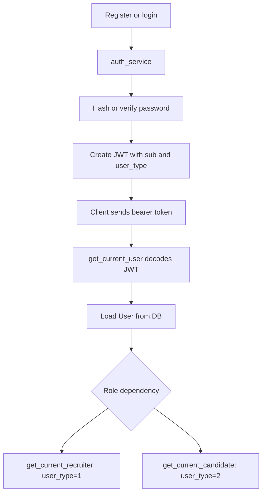

Current auth notes:

- Access tokens expire after 30 days.
- No refresh token flow.
- No password strength policy.
- No rate limiting.

## Authorization Model

Rules verified against current code:

- Candidate routes use `get_current_candidate`.
- Recruiter routes use `get_current_recruiter`.
- Candidate profile access checks `candidate.user_id == current_user.id`.
- Recruiter job management filters on `Job.recruiter_id == current_user.id`.
- Recruiter application listing verifies the job belongs to the recruiter.
- Recruiter application status updates verify the application belongs to a job owned by the recruiter.
- Candidate application listing resolves the authenticated user's candidate profile first.

Known authorization caveats:

- `GET /jobs/` and `GET /jobs/{job_id}` are public. `GET /jobs/{job_id}` returns `raw_jd` and parsed JD.
- `get_candidates()` still exists in `candidate_service.py` and returns all candidates if called internally. It is not exposed through a current route.

## Ownership Rules

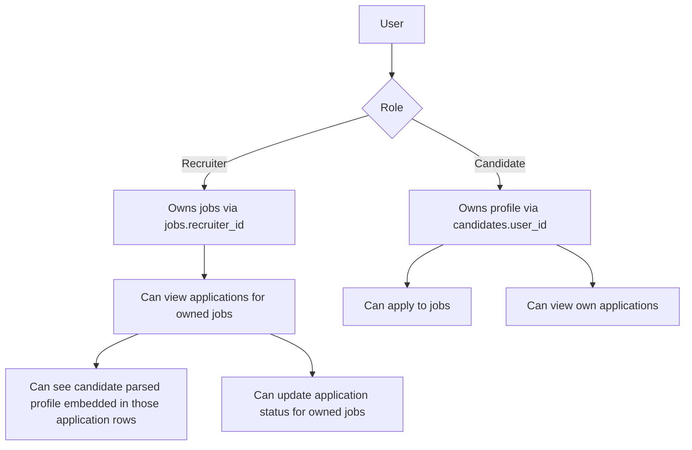

Candidate data visibility:

- Owning candidate can view their own profile.
- Recruiter can see candidate parsed profile only through applications for recruiter-owned jobs.
- Recruiter cannot browse all candidates.
- Recruiter cannot access random candidate profiles through `GET /candidates/{id}`.

Partial behavior:

- There is no dedicated recruiter candidate detail endpoint scoped by owned-job application relationship.
- Candidate can update profile only by re-uploading a resume; no manual edit endpoint exists.

## Candidate Pipeline

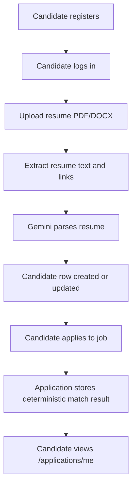

Current candidate endpoints:

- `POST /candidates/upload`
- `POST /candidates/github`
- `POST /candidates/linkedin`
- `GET /candidates/me`
- `GET /candidates/`
- `GET /candidates/{candidate_id}`
- `DELETE /candidates/{candidate_id}`
- `POST /jobs/{job_id}/apply`
- `GET /applications/me`

## Recruiter Pipeline

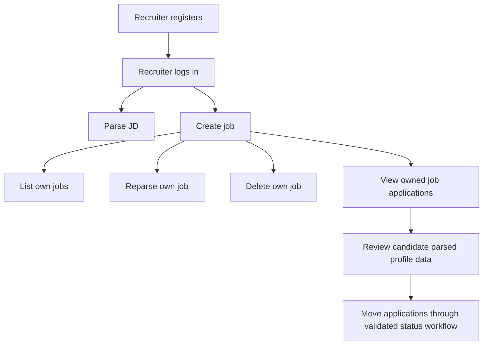

Current recruiter endpoints:

- `POST /jobs/parse`
- `POST /jobs/`
- `GET /jobs/my-jobs`
- `POST /jobs/{job_id}/reparse`
- `DELETE /jobs/{job_id}`
- `GET /jobs/{job_id}/applications`
- `PATCH /applications/{application_id}/status`

Application status workflow:

- Allowed statuses: `applied`, `reviewed`, `shortlisted`, `interview`, `rejected`, `hired`.
- Recruiter-only route: `PATCH /applications/{application_id}/status`.
- Request body: `{"status": "<allowed-status>"}`.
- Ownership: the authenticated recruiter must own the job linked to the application.
- Candidates cannot update status.
- Valid transitions are forward-only: `applied -> reviewed -> shortlisted -> interview -> hired`.
- `rejected` is allowed from any non-terminal status.
- `hired` and `rejected` are terminal statuses.
- Re-submitting the current status is idempotent and returns the unchanged application summary.
- Successful status changes update `applications.updated_at` and return the application summary.

## Resume Processing Flow

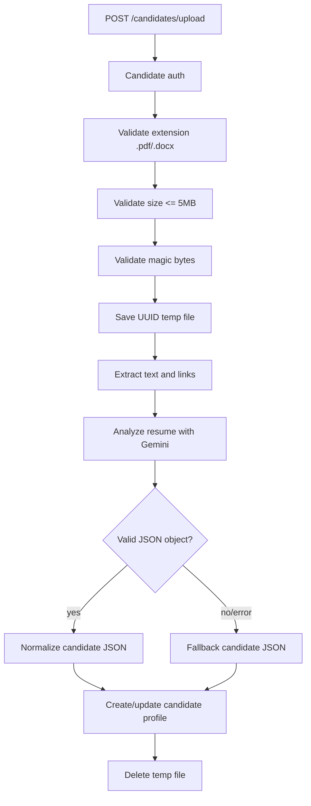

Current resume upload hardening:

- Does not store raw `resume.filename`.
- Generates UUID filenames.
- Allows `.pdf` and `.docx`.
- Enforces 5 MB max.
- Rejects empty files.
- Checks PDF/DOCX signatures.
- Cleans temp files on known failure paths.

## LinkedIn Processing Flow

Status: implemented for candidate-owned profiles.

MVP input format: PDF upload.

Required extraction targets:

- Headline.
- Positions.
- Education.
- Certifications.
- Skills.

Required implementation notes:

- Store structured LinkedIn output separately from resume data.
- Use `testprofile.pdf` as reference data. Current audit found it at backend root; it extracts as a 4-page LinkedIn profile for Ayush Pahuja with headline, summary, top skills, certifications, and experience content.
- Do not generate fake LinkedIn examples when the real reference PDF exists.

Current flow:

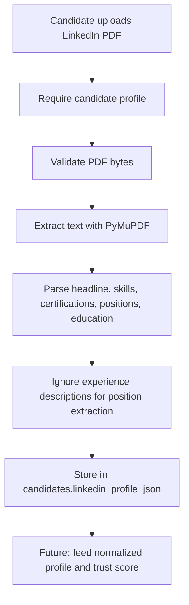

Current endpoint:

- `POST /candidates/linkedin`
  - Auth: candidate.
  - Upload field: `profile`.
  - Requires an existing candidate profile.
  - Accepts PDF content only.
  - Stores structured output in `candidates.linkedin_profile_json`.

## GitHub Processing Flow

Status: implemented.

Required input support:

- GitHub username.
- GitHub profile URL.
- GitHub repo URL.

Reference development account:

- `Lowdata`

Use real GitHub APIs and real response shapes whenever possible:

- `GET /users/{username}`
- `GET /users/{username}/repos`
- `GET /repos/{owner}/{repo}`
- `GET /repos/{owner}/{repo}/languages`
- `GET /repos/{owner}/{repo}/readme`
- `GET /users/{username}/events/public`

Current flow:

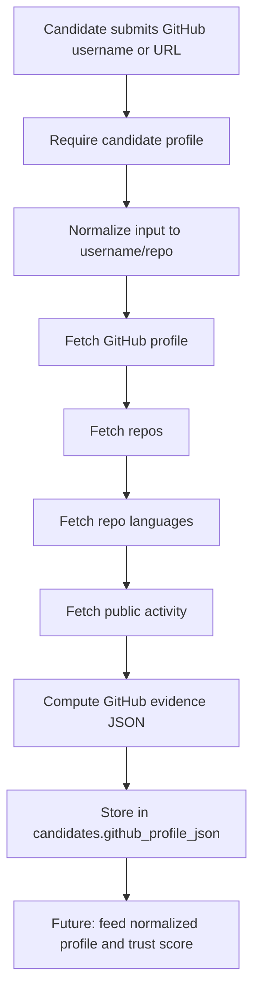

Implementation guardrails:

- Do not invent API response fields. The implementation maps real fields observed from `GET /users/Lowdata`, `GET /users/Lowdata/repos`, `GET /repos/{owner}/{repo}/languages`, and `GET /users/Lowdata/events/public`.
- Handle rate limits and unavailable data gracefully.
- Never require GitHub auth for public MVP analysis unless API limits demand it.

Current endpoint:

- `POST /candidates/github`
  - Auth: candidate.
  - Body examples:
    - `{"identifier": "Lowdata"}`
    - `{"identifier": "https://github.com/Lowdata"}`
    - `{"identifier": "https://github.com/Lowdata/CertiFit"}`
  - Requires an existing candidate profile.
  - Stores structured output in `candidates.github_profile_json`.

## Normalized Profile Generation

Status: implemented.

Current state:

- Resume parsing produces `parsed_candidate_json`.
- There is no unified normalized profile that merges resume, LinkedIn, and GitHub.

Target MVP shape should merge evidence from:

- Resume profile.
- LinkedIn PDF profile.
- GitHub evidence from `candidates.github_profile_json`.

Expected future flow:

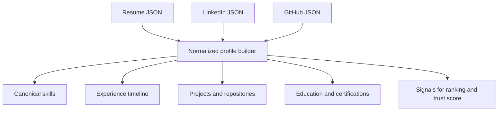

## Ranking Flow

Current status: implemented for resume/JD JSON.

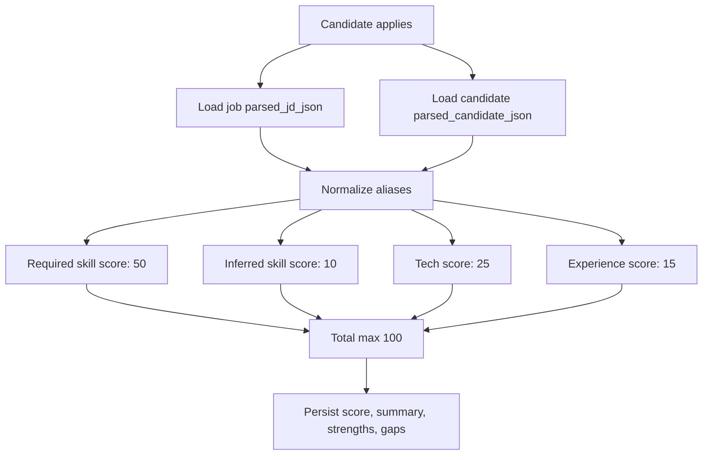

Current aliases:

- `Postgres` -> `PostgreSQL`
- `JS` -> `JavaScript`
- `Node` -> `Node.js`
- `React.js` -> `React`
- `TS` -> `TypeScript`

Future ranking should use normalized profile data once available, while staying deterministic for MVP.

## Trust Score Flow

Status: implemented.

Audit result:

- Trust score engine implemented via `trust_service.py` using weighted scoring.
- Do not assume trust scoring exists because candidate parsing has profile fields.

Expected future flow:

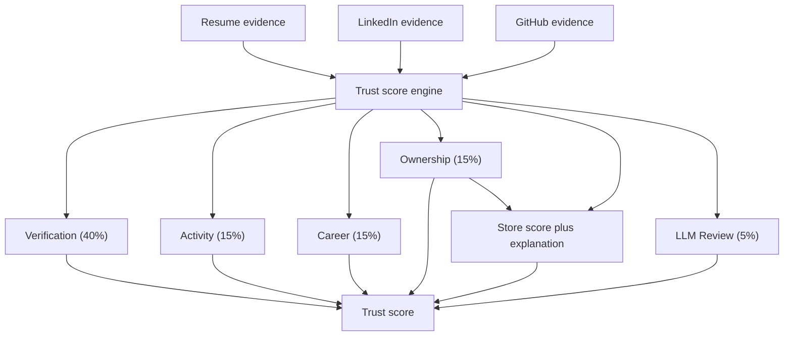

MVP trust score is explainable and deterministic. Trust Score is INTERNAL. Do NOT expose `trust_score` numeric values to candidates. Candidates only receive sanitized data (completeness status, missing evidence).

## Interview Copilot Flow

Status: implemented.

Current state:

- `app/api/interview.py` exists but is empty.
- No interview routes are registered in `app/main.py`.
- No interview models or services exist.

Expected future flow:

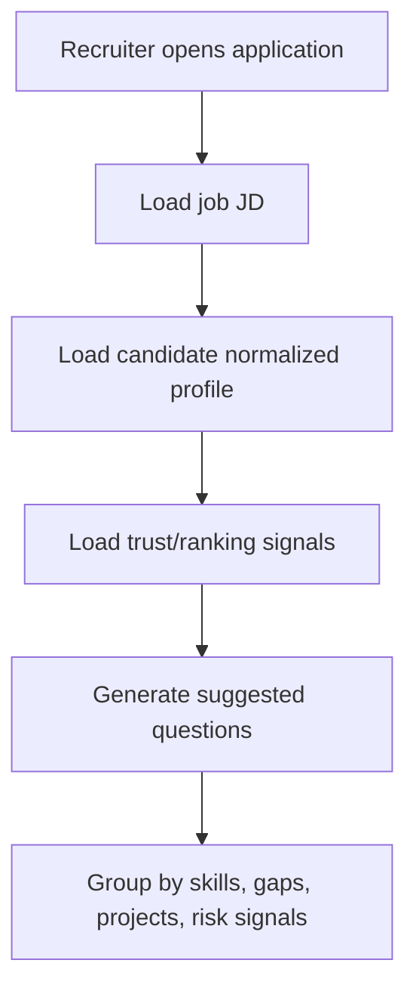

Keep this stateless for MVP unless persistence is explicitly needed.

## API Catalog

Route inventory from current app:

| Method | Path | Auth | Status |
| --- | --- | --- | --- |
| GET | `/health/` | Public | ✅ Implemented |
| POST | `/auth/register` | Public | ✅ Implemented |
| POST | `/auth/login` | Public | ✅ Implemented |
| GET | `/auth/me` | Bearer | ✅ Implemented |
| POST | `/jobs/parse` | Recruiter | ✅ Implemented |
| POST | `/jobs/` | Recruiter | ✅ Implemented |
| GET | `/jobs/my-jobs` | Recruiter | ✅ Implemented |
| GET | `/jobs/` | Public | ✅ Implemented |
| GET | `/jobs/{job_id}` | Public | ✅ Implemented |
| DELETE | `/jobs/{job_id}` | Recruiter owner | ✅ Implemented |
| POST | `/jobs/{job_id}/reparse` | Recruiter owner | ✅ Implemented |
| POST | `/jobs/{job_id}/apply` | Candidate | ✅ Implemented |
| GET | `/jobs/{job_id}/applications` | Recruiter owner | ✅ Implemented |
| POST | `/candidates/upload` | Candidate | ✅ Implemented + triggers profile rebuild |
| POST | `/candidates/github` | Candidate | ✅ Implemented + triggers profile rebuild |
| POST | `/candidates/linkedin` | Candidate | ✅ Implemented + triggers profile rebuild |
| GET | `/candidates/me` | Candidate | ✅ Implemented |
| GET | `/candidates/me/profile` | Candidate | ✅ Implemented — returns stored normalized profile |
| GET | `/candidates/me/trust` | Candidate | ✅ Implemented — returns stored trust score |
| POST | `/candidates/me/profile/rebuild` | Candidate | ✅ Implemented — force rebuild |
| GET | `/candidates/` | Candidate | ✅ Implemented |
| GET | `/candidates/{candidate_id}` | Candidate owner | ✅ Implemented |
| DELETE | `/candidates/{candidate_id}` | Candidate owner | ✅ Implemented |
| GET | `/applications/me` | Candidate | ✅ Implemented |
| PATCH | `/applications/{id}/status` | Recruiter owner | ✅ Implemented |
| POST | `/applications/{id}/interview-plan` | Recruiter owner | ✅ Implemented — full context-aware LLM interview copilot |
| GET | `/applications/{id}/candidate-report` | Recruiter owner | ✅ Implemented — **demo endpoint** |


## Security Model

Current protections:

- JWT bearer authentication.
- Central recruiter/candidate role dependencies.
- Candidate ownership checks.
- Recruiter job ownership checks.
- Application visibility scoped to owned jobs.
- Upload path stripping and UUID storage names.
- Upload extension, size, and basic content validation.
- Error logging for critical parser/database failures.

Known production gaps:

- SQLAlchemy `echo=True` should be disabled in production.
- Token TTL is long.
- No refresh token/session revocation.
- No password policy.
- No rate limits.
- No CORS config.
- No malware scanning for uploads.
- No explicit data retention policy.
- No request-size limit at server/proxy level visible in repo.

## Migration Strategy

Alembic is the real migration flow.

Current migration chain:

- `0001_baseline`
- `0002_add_ownership`
- `0003_create_applications`
- `0004_add_candidate_github`
- `0005_add_candidate_linkedin`

Operational notes:

- Use `alembic upgrade head` for shared DBs.
- Do not use `create.py` except for disposable local development.
- `0002_add_ownership` only backfills automatically if there is exactly one recruiter/candidate; otherwise it intentionally fails and requires manual ownership backfill.
- Existing DB upgrade path should be tested against staging Postgres before production.

## Test Coverage

Current test suite:

- Auth/privacy:
  - recruiter cannot list global candidates;
  - candidate can only read own profile;
  - recruiter can only view applications for owned jobs.
- Applications:
  - duplicate apply protection.
- Uploads:
  - unsupported type rejection;
  - generated filename;
  - parser failure API error.
- Parser/ranking:
  - fallback candidate shape;
  - LLM shape normalization;
  - technology alias normalization.
- GitHub:
  - username/profile URL/repo URL parsing;
  - candidate GitHub profile storage;
  - candidate profile required before GitHub ingestion.
- LinkedIn:
  - parser validation against `testprofile.pdf`;
  - candidate LinkedIn profile storage;
  - candidate profile required before LinkedIn ingestion;
  - invalid PDF rejection.

Current verification commands:

```text
venv/bin/pytest -q
venv/bin/ruff check .
venv/bin/alembic heads
```

Recommended next tests:

- Recruiter cannot call `GET /candidates/{candidate_id}`.
- Candidate can view own applications end to end.
- Candidate cannot delete another candidate profile.
- Recruiter cannot delete/reparse another recruiter's job.
- Candidate cannot call recruiter-only routes.
- Recruiter cannot call candidate-only routes.
- Upload rejects oversized file.
- Upload rejects invalid PDF/DOCX magic bytes.
- GitHub API client tests using real response fixtures.
- Normalized profile and trust score tests.

## Known Limitations

- `backend.md` was absent before this documentation pass; previous detailed audit existed as `docs/BACKEND_ARCHITECTURE.md`.
- `tests/testprofile.pdf` is the tracked LinkedIn parser fixture. A root-level `testprofile.pdf` may also exist as local reference data.
- GitHub ingestion exists, but it currently uses unauthenticated public API calls and does not persist raw API responses.
- Trust scoring implemented.
- LinkedIn ingestion exists, but it is deterministic section parsing only and does not use LLM cleanup yet.
- Normalized profile generation is implemented via `profile_service.py`.
- Interview copilot is implemented.
- Candidate manual profile editing is pending.
- Recruiter candidate detail endpoint scoped through application relationship is pending.
- Public job detail exposes raw JD and parsed JD.

## Future Roadmap

Recommended implementation order:

1. Update ranking to read normalized profile while preserving deterministic MVP behavior.
2. Add recruiter-scoped candidate detail endpoint if product requires it.
5. Add stateless interview copilot endpoint.
6. Harden production config, CORS, token/session policy, upload scanning, and CI.

Completed roadmap items:

- `backend.md` established as source of truth.
- GitHub input normalization, API client, candidate endpoint, storage, migration, and tests added.
- LinkedIn PDF parser, candidate endpoint, storage, migration, and tests added.

## Current Audit Notes

Commands run during this audit:

```text
git status --short --branch
rg --files -g 'backend.md' -g 'BACKEND_ARCHITECTURE.md' -g '*.md'
rg -n "trust|github|linkedin|profile|interview|normalized|copilot" app tests docs .
find /Users/ayushpahuja/tests/certifit -maxdepth 6 -iname 'testprofile.pdf'
venv/bin/python - <<'PY'
import fitz
doc = fitz.open("testprofile.pdf")
print(doc.page_count)
doc.close()
PY
```

Findings:

- No committed or uncommitted `backend.md` existed.
- `testprofile.pdf` was found at backend root and can be parsed by PyMuPDF.
- Only GitHub/LinkedIn references are in resume parser output schema/fallback docs.
- No trust score implementation exists.
- Normalized profile canonical mapping implemented in `profile_service.py`.
- No interview copilot implementation exists.


## Function Catalog


### File: `app/api/app.py`

#### Function: `health`
- **What it does**: No docstring provided.
- **Where it is used**: Internal, Route Endpoint, or Not Exported
- **Pseudo-code**:
```python
def health():
    return { ...
```

### File: `app/api/applications.py`

#### Function: `_application_summary`
- **What it does**: No docstring provided.
- **Where it is used**: Internal, Route Endpoint, or Not Exported
- **Pseudo-code**:
```python
def _application_summary(application):
    return { ...
```
#### Function: `list_my_applications`
- **What it does**: No docstring provided.
- **Where it is used**: Internal, Route Endpoint, or Not Exported
- **Pseudo-code**:
```python
def list_my_applications(db, current_user):
    candidate = get_candidate_by_user_id( ...
    if not candidate: ...
    applications = get_applications_for_candidate( ...
```
#### Function: `change_application_status`
- **What it does**: No docstring provided.
- **Where it is used**: Internal, Route Endpoint, or Not Exported
- **Pseudo-code**:
```python
def change_application_status(application_id, data, db, current_user):
    try: ...
    return _application_summary(application) ...
```
#### Function: `get_candidate_report`
- **What it does**: Demo endpoint — returns the full candidate intelligence report in one call.
- **Where it is used**: Internal, Route Endpoint, or Not Exported
- **Pseudo-code**:
```python
def get_candidate_report(application_id, db, current_user):
    from app.models.application import Application ...
    from app.models.candidate import Candidate ...
    from app.models.job import Job ...
```

### File: `app/api/auth.py`

#### Function: `register`
- **What it does**: No docstring provided.
- **Where it is used**: Internal, Route Endpoint, or Not Exported
- **Pseudo-code**:
```python
def register(data, db):
    try: ...
```
#### Function: `login`
- **What it does**: No docstring provided.
- **Where it is used**: Internal, Route Endpoint, or Not Exported
- **Pseudo-code**:
```python
def login(data, db):
    result = login_user( ...
    if not result: ...
    return { ...
```
#### Function: `me`
- **What it does**: No docstring provided.
- **Where it is used**: app/models/job.py, app/services/profile_service.py, app/services/linkedin_service.py, app/models/candidate.py, app/services/candidate_service.py, app/services/llm_candidate_analyzer.py, app/models/application.py, app/services/trust_service.py, app/models/user.py
- **Pseudo-code**:
```python
def me(current_user):
    return { ...
```

### File: `app/api/candidates.py`

#### Function: `_safe_resume_extension`
- **What it does**: No docstring provided.
- **Where it is used**: Internal, Route Endpoint, or Not Exported
- **Pseudo-code**:
```python
def _safe_resume_extension(filename):
    suffix = Path(filename or "").name.lower() ...
    extension = Path(suffix).suffix ...
    if extension not in ALLOWED_EXTENSIONS: ...
```
#### Function: `_validate_resume_content`
- **What it does**: No docstring provided.
- **Where it is used**: Internal, Route Endpoint, or Not Exported
- **Pseudo-code**:
```python
def _validate_resume_content(content, extension):
    if not content: ...
    if len(content) > MAX_RESUME_SIZE_BYTES: ...
    if extension == ".pdf" and not content.startswith(PDF_SIGNATURE): ...
```
#### Function: `upload_candidate`
- **What it does**: No docstring provided.
- **Where it is used**: Internal, Route Endpoint, or Not Exported
- **Pseudo-code**:
```python
def upload_candidate(resume, db, current_user):
    Path(UPLOAD_DIR).mkdir( ...
    extension = _safe_resume_extension(resume.filename) ...
    stored_file_name = f"{uuid4().hex}{extension}" ...
```
#### Function: `get_my_candidate_profile`
- **What it does**: No docstring provided.
- **Where it is used**: Internal, Route Endpoint, or Not Exported
- **Pseudo-code**:
```python
def get_my_candidate_profile(db, current_user):
    candidate = get_candidate_by_user_id( ...
    if not candidate: ...
    return { ...
```
#### Function: `upload_github_profile`
- **What it does**: No docstring provided.
- **Where it is used**: Internal, Route Endpoint, or Not Exported
- **Pseudo-code**:
```python
def upload_github_profile(data, db, current_user):
    candidate = get_candidate_by_user_id( ...
    if not candidate: ...
    try: ...
```
#### Function: `upload_linkedin_profile`
- **What it does**: No docstring provided.
- **Where it is used**: Internal, Route Endpoint, or Not Exported
- **Pseudo-code**:
```python
def upload_linkedin_profile(profile, db, current_user):
    candidate = get_candidate_by_user_id( ...
    if not candidate: ...
    try: ...
```
#### Function: `get_my_normalized_profile`
- **What it does**: Return stored normalized profile (DB read — no rebuild).
- **Where it is used**: Internal, Route Endpoint, or Not Exported
- **Pseudo-code**:
```python
def get_my_normalized_profile(db, current_user):
    candidate = get_candidate_by_user_id(db=db, user_id=current_user.id) ...
    if not candidate: ...
    return { ...
```
#### Function: `get_my_trust_score`
- **What it does**: Return stored trust score (DB read — no rebuild).
- **Where it is used**: Internal, Route Endpoint, or Not Exported
- **Pseudo-code**:
```python
def get_my_trust_score(db, current_user):
    candidate = get_candidate_by_user_id(db=db, user_id=current_user.id) ...
    if not candidate: ...
    return { ...
```
#### Function: `rebuild_my_profile`
- **What it does**: Force rebuild of normalized profile and trust score.
- **Where it is used**: Internal, Route Endpoint, or Not Exported
- **Pseudo-code**:
```python
def rebuild_my_profile(db, current_user):
    candidate = get_candidate_by_user_id(db=db, user_id=current_user.id) ...
    if not candidate: ...
    profile, trust = rebuild_candidate_intelligence(db=db, candidate=candidate) ...
```
#### Function: `list_candidates`
- **What it does**: No docstring provided.
- **Where it is used**: Internal, Route Endpoint, or Not Exported
- **Pseudo-code**:
```python
def list_candidates(page, page_size, db, current_user):
    candidate = get_candidate_by_user_id( ...
    data = [] ...
    if candidate: ...
```
#### Function: `get_candidate`
- **What it does**: No docstring provided.
- **Where it is used**: Internal, Route Endpoint, or Not Exported
- **Pseudo-code**:
```python
def get_candidate(candidate_id, db, current_user):
    candidate = get_candidate_by_id( ...
    if not candidate: ...
    if candidate.user_id != current_user.id: ...
```
#### Function: `remove_candidate`
- **What it does**: No docstring provided.
- **Where it is used**: Internal, Route Endpoint, or Not Exported
- **Pseudo-code**:
```python
def remove_candidate(candidate_id, db, current_user):
    candidate = delete_candidate( ...
    if not candidate: ...
    return { ...
```

### File: `app/api/interview.py`

#### Function: `_verify_recruiter_owns_application`
- **What it does**: Load application + candidate + job, verify the recruiter owns the job.
- **Where it is used**: Internal, Route Endpoint, or Not Exported
- **Pseudo-code**:
```python
def _verify_recruiter_owns_application(db, application_id, recruiter_id):
    row = ( ...
    if not row: ...
    return row ...
```
#### Function: `create_interview_plan`
- **What it does**: Generate a structured interview plan for a candidate application.
- **Where it is used**: Internal, Route Endpoint, or Not Exported
- **Pseudo-code**:
```python
def create_interview_plan(application_id, db, current_user):
    application, candidate, job = _verify_recruiter_owns_application( ...
    plan = generate_interview_plan( ...
    return { ...
```

### File: `app/api/jobs.py`

#### Function: `parse_job`
- **What it does**: No docstring provided.
- **Where it is used**: app/services/job_service.py
- **Pseudo-code**:
```python
def parse_job(data, current_user):
    return { ...
```
#### Function: `create_new_job`
- **What it does**: No docstring provided.
- **Where it is used**: Internal, Route Endpoint, or Not Exported
- **Pseudo-code**:
```python
def create_new_job(data, db, current_user):
    job = create_job( ...
    return { ...
```
#### Function: `list_my_jobs`
- **What it does**: No docstring provided.
- **Where it is used**: Internal, Route Endpoint, or Not Exported
- **Pseudo-code**:
```python
def list_my_jobs(page, page_size, db, current_user):
    jobs, total = get_jobs_by_recruiter( ...
    return { ...
```
#### Function: `list_jobs`
- **What it does**: No docstring provided.
- **Where it is used**: Internal, Route Endpoint, or Not Exported
- **Pseudo-code**:
```python
def list_jobs(page, page_size, company, title, db):
    jobs, total = get_jobs( ...
    return { ...
```
#### Function: `get_job`
- **What it does**: No docstring provided.
- **Where it is used**: Internal, Route Endpoint, or Not Exported
- **Pseudo-code**:
```python
def get_job(job_id, db):
    job = get_job_by_id( ...
    if not job: ...
    return { ...
```
#### Function: `remove_job`
- **What it does**: No docstring provided.
- **Where it is used**: Internal, Route Endpoint, or Not Exported
- **Pseudo-code**:
```python
def remove_job(job_id, db, current_user):
    job = delete_job( ...
    if not job: ...
    return { ...
```
#### Function: `reparse_existing_job`
- **What it does**: No docstring provided.
- **Where it is used**: Internal, Route Endpoint, or Not Exported
- **Pseudo-code**:
```python
def reparse_existing_job(job_id, db, current_user):
    job = reparse_job( ...
    if not job: ...
    return { ...
```
#### Function: `apply_to_job`
- **What it does**: No docstring provided.
- **Where it is used**: Internal, Route Endpoint, or Not Exported
- **Pseudo-code**:
```python
def apply_to_job(job_id, db, current_user):
    candidate = get_candidate_by_user_id( ...
    if not candidate: ...
    try: ...
```
#### Function: `list_job_applications`
- **What it does**: No docstring provided.
- **Where it is used**: Internal, Route Endpoint, or Not Exported
- **Pseudo-code**:
```python
def list_job_applications(job_id, db, current_user):
    application_rows = get_applications_for_owned_job( ...
    job = get_job_by_id( ...
    if not job or job.recruiter_id != current_user.id: ...
```

### File: `app/core/dependencies.py`

#### Function: `get_current_user`
- **What it does**: No docstring provided.
- **Where it is used**: Internal, Route Endpoint, or Not Exported
- **Pseudo-code**:
```python
def get_current_user(credentials, db):
    token = credentials.credentials ...
    payload = decode_access_token( ...
    if not payload: ...
```
#### Function: `get_current_recruiter`
- **What it does**: No docstring provided.
- **Where it is used**: Internal, Route Endpoint, or Not Exported
- **Pseudo-code**:
```python
def get_current_recruiter(current_user):
    if current_user.user_type != 1: ...
    return current_user ...
```
#### Function: `get_current_candidate`
- **What it does**: No docstring provided.
- **Where it is used**: Internal, Route Endpoint, or Not Exported
- **Pseudo-code**:
```python
def get_current_candidate(current_user):
    if current_user.user_type != 2: ...
    return current_user ...
```

### File: `app/core/security.py`

#### Function: `hash_password`
- **What it does**: No docstring provided.
- **Where it is used**: app/services/auth_service.py
- **Pseudo-code**:
```python
def hash_password(password):
    return password_hash.hash(password) ...
```
#### Function: `verify_password`
- **What it does**: No docstring provided.
- **Where it is used**: app/services/auth_service.py
- **Pseudo-code**:
```python
def verify_password(plain_password, hashed_password):
    return password_hash.verify( ...
```
#### Function: `create_access_token`
- **What it does**: No docstring provided.
- **Where it is used**: app/services/auth_service.py
- **Pseudo-code**:
```python
def create_access_token(user_id, user_type):
    expire = datetime.now( ...
    payload = { ...
    return jwt.encode( ...
```
#### Function: `decode_access_token`
- **What it does**: No docstring provided.
- **Where it is used**: app/core/dependencies.py
- **Pseudo-code**:
```python
def decode_access_token(token):
    try: ...
```

### File: `app/db/database.py`

#### Function: `get_db`
- **What it does**: No docstring provided.
- **Where it is used**: Internal, Route Endpoint, or Not Exported
- **Pseudo-code**:
```python
def get_db():
    db = SessionLocal() ...
    try: ...
```

### File: `app/services/application_service.py`

#### Function: `_canonical_term`
- **What it does**: No docstring provided.
- **Where it is used**: Internal, Route Endpoint, or Not Exported
- **Pseudo-code**:
```python
def _canonical_term(value):
    cleaned = re.sub( ...
    if not cleaned: ...
    key = re.sub(r"[^a-z0-9+#.]", "", cleaned.lower()) ...
```
#### Function: `_as_set`
- **What it does**: No docstring provided.
- **Where it is used**: Internal, Route Endpoint, or Not Exported
- **Pseudo-code**:
```python
def _as_set(values):
    if not values: ...
    return { ...
```
#### Function: `_tech_values`
- **What it does**: No docstring provided.
- **Where it is used**: Internal, Route Endpoint, or Not Exported
- **Pseudo-code**:
```python
def _tech_values(tech_stack):
    values = [] ...
    if not isinstance(tech_stack, dict): ...
    for item in tech_stack.values(): ...
```
#### Function: `_candidate_skill_terms`
- **What it does**: Return the candidate's skill terms for matching.
- **Where it is used**: Internal, Route Endpoint, or Not Exported
- **Pseudo-code**:
```python
def _candidate_skill_terms(candidate):
    profile = getattr(candidate, "normalized_profile_json", None) or {} ...
    normalized_skills = profile.get("skills") ...
    if normalized_skills: ...
```
#### Function: `calculate_match`
- **What it does**: No docstring provided.
- **Where it is used**: Internal, Route Endpoint, or Not Exported
- **Pseudo-code**:
```python
def calculate_match(job, candidate):
    job_data = job.parsed_jd_json or {} ...
    candidate_data = candidate.parsed_candidate_json or {} ...
    required_skills = _as_set( ...
```
#### Function: `_composite_score`
- **What it does**: composite = fit * (0.6 + 0.4 * (trust / 100))
- **Where it is used**: Internal, Route Endpoint, or Not Exported
- **Pseudo-code**:
```python
def _composite_score(fit_score, trust_score):
    normalised_trust = max(0.0, min(trust_score, 100.0)) / 100.0 ...
    raw = fit_score * (0.6 + 0.4 * normalised_trust) ...
    return round(min(raw, 100.0), 2) ...
```
#### Function: `_build_score_explanations`
- **What it does**: Build the human-readable score_explanations dict.
- **Where it is used**: Internal, Route Endpoint, or Not Exported
- **Pseudo-code**:
```python
def _build_score_explanations(fit_score, trust_score, composite_score, strengths, trust_data, profile):
    why: list[str] = [] ...
    profile = profile or {} ...
    for strength in (trust_data.get("strengths") or [])[:3]: ...
```
#### Function: `create_application`
- **What it does**: No docstring provided.
- **Where it is used**: app/api/jobs.py
- **Pseudo-code**:
```python
def create_application(db, job_id, candidate):
    job = ( ...
    if not job: ...
    existing = ( ...
```
#### Function: `get_applications_for_candidate`
- **What it does**: No docstring provided.
- **Where it is used**: app/api/applications.py
- **Pseudo-code**:
```python
def get_applications_for_candidate(db, candidate_id):
    return ( ...
```
#### Function: `get_applications_for_owned_job`
- **What it does**: No docstring provided.
- **Where it is used**: app/api/jobs.py
- **Pseudo-code**:
```python
def get_applications_for_owned_job(db, job_id, recruiter_id):
    return ( ...
```
#### Function: `update_application_status`
- **What it does**: No docstring provided.
- **Where it is used**: app/api/applications.py
- **Pseudo-code**:
```python
def update_application_status(db, application_id, recruiter_id, status):
    if status not in ALLOWED_APPLICATION_STATUSES: ...
    application = ( ...
    if not application: ...
```
#### Function: `build_claims_report`
- **What it does**: Build a per-skill transparency report for the recruiter candidate report.
- **Where it is used**: app/api/applications.py
- **Pseudo-code**:
```python
def build_claims_report(candidate):
    profile = getattr(candidate, "normalized_profile_json", None) or {} ...
    evidence_map = profile.get("evidence_map") or {} ...
    skill_confidence = profile.get("skill_confidence") or {} ...
```

### File: `app/services/auth_service.py`

#### Function: `register_user`
- **What it does**: No docstring provided.
- **Where it is used**: app/api/auth.py
- **Pseudo-code**:
```python
def register_user(db, name, email, password, user_type):
    if user_type not in (1, 2): ...
    existing = ( ...
    if existing: ...
```
#### Function: `login_user`
- **What it does**: No docstring provided.
- **Where it is used**: app/api/auth.py
- **Pseudo-code**:
```python
def login_user(db, email, password):
    user = ( ...
    if not user: ...
    if not verify_password( ...
```

### File: `app/services/candidate_service.py`

#### Function: `create_candidate`
- **What it does**: No docstring provided.
- **Where it is used**: app/api/candidates.py
- **Pseudo-code**:
```python
def create_candidate(db, user_id, file_path, file_name):
    try: ...
    candidate = get_candidate_by_user_id( ...
    if candidate: ...
```
#### Function: `get_candidates`
- **What it does**: No docstring provided.
- **Where it is used**: Internal, Route Endpoint, or Not Exported
- **Pseudo-code**:
```python
def get_candidates(db, page, page_size):
    query = db.query(Candidate) ...
    total = query.count() ...
    candidates = ( ...
```
#### Function: `get_candidate_by_id`
- **What it does**: No docstring provided.
- **Where it is used**: app/api/candidates.py
- **Pseudo-code**:
```python
def get_candidate_by_id(db, candidate_id):
    return ( ...
```
#### Function: `get_candidate_by_user_id`
- **What it does**: No docstring provided.
- **Where it is used**: app/api/candidates.py, app/api/jobs.py, app/api/applications.py
- **Pseudo-code**:
```python
def get_candidate_by_user_id(db, user_id):
    return ( ...
```
#### Function: `delete_candidate`
- **What it does**: No docstring provided.
- **Where it is used**: app/api/candidates.py
- **Pseudo-code**:
```python
def delete_candidate(db, candidate_id, user_id):
    query = db.query(Candidate).filter( ...
    if user_id is not None: ...
    candidate = query.first() ...
```
#### Function: `update_candidate_github_profile`
- **What it does**: No docstring provided.
- **Where it is used**: app/api/candidates.py
- **Pseudo-code**:
```python
def update_candidate_github_profile(db, user_id, github_profile):
    candidate = get_candidate_by_user_id( ...
    if not candidate: ...
    candidate.github_profile_json = github_profile ...
```
#### Function: `update_candidate_linkedin_profile`
- **What it does**: No docstring provided.
- **Where it is used**: app/api/candidates.py
- **Pseudo-code**:
```python
def update_candidate_linkedin_profile(db, user_id, linkedin_profile):
    candidate = get_candidate_by_user_id( ...
    if not candidate: ...
    candidate.linkedin_profile_json = linkedin_profile ...
```
#### Function: `rebuild_candidate_intelligence`
- **What it does**: Rebuild normalized_profile_json and trust_score_json for a candidate.
- **Where it is used**: app/api/candidates.py
- **Pseudo-code**:
```python
def rebuild_candidate_intelligence(db, candidate):
    from app.services.profile_service import build_normalized_profile ...
    from app.services.trust_service import calculate_trust_score ...
    profile = {} ...
```

### File: `app/services/github_service.py`

#### Function: `parse_github_identifier`
- **What it does**: No docstring provided.
- **Where it is used**: Internal, Route Endpoint, or Not Exported
- **Pseudo-code**:
```python
def parse_github_identifier(identifier):
    value = identifier.strip() ...
    if not value: ...
    if "://" not in value and "/" not in value: ...
```
#### Function: `_request_json`
- **What it does**: No docstring provided.
- **Where it is used**: Internal, Route Endpoint, or Not Exported
- **Pseudo-code**:
```python
def _request_json(path):
    try: ...
    if response.status_code == 404: ...
    if response.status_code >= 400: ...
```
#### Function: `_summarize_user`
- **What it does**: No docstring provided.
- **Where it is used**: Internal, Route Endpoint, or Not Exported
- **Pseudo-code**:
```python
def _summarize_user(user):
    return { ...
```
#### Function: `_summarize_repo`
- **What it does**: No docstring provided.
- **Where it is used**: Internal, Route Endpoint, or Not Exported
- **Pseudo-code**:
```python
def _summarize_repo(repo, languages):
    return { ...
```
#### Function: `_summarize_event`
- **What it does**: No docstring provided.
- **Where it is used**: Internal, Route Endpoint, or Not Exported
- **Pseudo-code**:
```python
def _summarize_event(event):
    return { ...
```
#### Function: `analyze_github_profile`
- **What it does**: No docstring provided.
- **Where it is used**: app/api/candidates.py
- **Pseudo-code**:
```python
def analyze_github_profile(identifier):
    parsed = parse_github_identifier(identifier) ...
    user = _request_json(f"/users/{parsed.username}") ...
    repos = _request_json( ...
```

### File: `app/services/interview_service.py`

#### Function: `_deterministic_technical`
- **What it does**: Generate technical questions from JD required skills + candidate profile.
- **Where it is used**: Internal, Route Endpoint, or Not Exported
- **Pseudo-code**:
```python
def _deterministic_technical(required_skills, profile):
    questions: list[str] = [] ...
    evidence_map = profile.get("evidence_map") or {} ...
    for skill in required_skills[:6]: ...
```
#### Function: `_deterministic_behavioral`
- **What it does**: Generate behavioral questions from job seniority/leadership signals.
- **Where it is used**: Internal, Route Endpoint, or Not Exported
- **Pseudo-code**:
```python
def _deterministic_behavioral(job_data):
    seniority = (job_data.get("seniority") or "").lower() ...
    if seniority in {"lead", "staff", "principal"}: ...
    if seniority in {"senior"}: ...
```
#### Function: `_deterministic_verification`
- **What it does**: Generate verification questions from trust concerns and unsupported claims.
- **Where it is used**: Internal, Route Endpoint, or Not Exported
- **Pseudo-code**:
```python
def _deterministic_verification(trust_data):
    questions: list[str] = [] ...
    for concern in (trust_data.get("concerns") or [])[:4]: ...
    for claim in (trust_data.get("unsupported_claims") or [])[:4]: ...
```
#### Function: `_deterministic_project`
- **What it does**: Generate project walk-through questions from GitHub repos and project URLs.
- **Where it is used**: Internal, Route Endpoint, or Not Exported
- **Pseudo-code**:
```python
def _deterministic_project(profile):
    questions: list[str] = [] ...
    projects = profile.get("projects") or [] ...
    for project in projects[:3]: ...
```
#### Function: `_fallback_interview_plan`
- **What it does**: No docstring provided.
- **Where it is used**: Internal, Route Endpoint, or Not Exported
- **Pseudo-code**:
```python
def _fallback_interview_plan(reason):
    return { ...
```
#### Function: `_llm_enrich_questions`
- **What it does**: Use Gemini to generate deep, profile-aware interview questions grounded in
- **Where it is used**: Internal, Route Endpoint, or Not Exported
- **Pseudo-code**:
```python
def _llm_enrich_questions(technical, behavioral, verification, project, job_title, job_description, candidate_profile, trust_data, fit_score, trust_score):
    try: ...
    prompt = f"""You are an Expert Technical Interviewer hiring for the role of {job_title}. ...
    schema_keys = [ ...
```
#### Function: `generate_interview_plan`
- **What it does**: Generate a structured interview plan.
- **Where it is used**: app/api/interview.py, app/api/applications.py
- **Pseudo-code**:
```python
def generate_interview_plan(job, candidate, application):
    job_data = job.parsed_jd_json or {} ...
    profile = candidate.normalized_profile_json or {} ...
    trust_data = candidate.trust_score_json or {} ...
```
#### Function: `_fallback`
- **What it does**: No docstring provided.
- **Where it is used**: Internal, Route Endpoint, or Not Exported
- **Pseudo-code**:
```python
def _fallback(reason):
    return { ...
```

### File: `app/services/jd_parser.py`

#### Function: `parse_job_description`
- **What it does**: No docstring provided.
- **Where it is used**: app/api/jobs.py, app/services/job_service.py
- **Pseudo-code**:
```python
def parse_job_description(jd):
    result = analyze_job_with_llm(jd) ...
    return result ...
```

### File: `app/services/job_service.py`

#### Function: `create_job`
- **What it does**: No docstring provided.
- **Where it is used**: app/api/jobs.py
- **Pseudo-code**:
```python
def create_job(db, recruiter_id, title, company, jd):
    try: ...
    job = Job( ...
    try: ...
```
#### Function: `get_jobs`
- **What it does**: No docstring provided.
- **Where it is used**: app/api/jobs.py
- **Pseudo-code**:
```python
def get_jobs(db, page, page_size, company, title):
    query = db.query(Job) ...
    if company: ...
    if title: ...
```
#### Function: `get_jobs_by_recruiter`
- **What it does**: No docstring provided.
- **Where it is used**: app/api/jobs.py
- **Pseudo-code**:
```python
def get_jobs_by_recruiter(db, recruiter_id, page, page_size):
    query = db.query(Job).filter( ...
    total = query.count() ...
    jobs = ( ...
```
#### Function: `get_job_by_id`
- **What it does**: No docstring provided.
- **Where it is used**: app/api/jobs.py
- **Pseudo-code**:
```python
def get_job_by_id(db, job_id):
    return ( ...
```
#### Function: `delete_job`
- **What it does**: No docstring provided.
- **Where it is used**: app/api/jobs.py
- **Pseudo-code**:
```python
def delete_job(db, job_id, recruiter_id):
    job = ( ...
    if not job: ...
    try: ...
```
#### Function: `reparse_job`
- **What it does**: No docstring provided.
- **Where it is used**: app/api/jobs.py
- **Pseudo-code**:
```python
def reparse_job(db, job_id, recruiter_id):
    job = ( ...
    if not job: ...
    try: ...
```

### File: `app/services/linkedin_service.py`

#### Function: `validate_linkedin_pdf`
- **What it does**: No docstring provided.
- **Where it is used**: Internal, Route Endpoint, or Not Exported
- **Pseudo-code**:
```python
def validate_linkedin_pdf(content):
    if not content: ...
    if len(content) > LINKEDIN_MAX_PDF_SIZE_BYTES: ...
    if not content.startswith(PDF_SIGNATURE): ...
```
#### Function: `extract_linkedin_text`
- **What it does**: No docstring provided.
- **Where it is used**: Internal, Route Endpoint, or Not Exported
- **Pseudo-code**:
```python
def extract_linkedin_text(content):
    validate_linkedin_pdf(content) ...
    try: ...
    try: ...
```
#### Function: `_clean_lines`
- **What it does**: No docstring provided.
- **Where it is used**: Internal, Route Endpoint, or Not Exported
- **Pseudo-code**:
```python
def _clean_lines(text):
    lines = [] ...
    for line in text.replace("\xa0", " ").splitlines(): ...
    return lines ...
```
#### Function: `_find_sections`
- **What it does**: Return {section_name: line_index} for all detected LinkedIn sections.
- **Where it is used**: Internal, Route Endpoint, or Not Exported
- **Pseudo-code**:
```python
def _find_sections(lines):
    sections: dict[str, int] = {} ...
    for i, line in enumerate(lines): ...
    return sections ...
```
#### Function: `_section_lines`
- **What it does**: Get the content lines for a section (up to the next section header).
- **Where it is used**: Internal, Route Endpoint, or Not Exported
- **Pseudo-code**:
```python
def _section_lines(lines, sections, section_name):
    start = sections.get(section_name) ...
    if start is None: ...
    end = len(lines) ...
```
#### Function: `_looks_like_person_name`
- **What it does**: Heuristic: does this line look like a person's name?
- **Where it is used**: Internal, Route Endpoint, or Not Exported
- **Pseudo-code**:
```python
def _looks_like_person_name(line):
    words = line.split() ...
    if len(words) < 2 or len(words) > 4: ...
    if not words[0][0].isupper(): ...
```
#### Function: `_looks_like_location`
- **What it does**: Heuristic: does this line look like a geographic location?
- **Where it is used**: Internal, Route Endpoint, or Not Exported
- **Pseudo-code**:
```python
def _looks_like_location(line):
    lowered = line.lower() ...
    if any(term in lowered for term in _LOCATION_TERMS): ...
    if "area" in lowered: ...
```
#### Function: `_profile_header`
- **What it does**: Extract name, headline, location by working backward from Summary.
- **Where it is used**: Internal, Route Endpoint, or Not Exported
- **Pseudo-code**:
```python
def _profile_header(lines, sections):
    warnings: list[str] = [] ...
    summary_idx = sections.get("Summary") ...
    if summary_idx is None or summary_idx < 2: ...
```
#### Function: `_top_skills`
- **What it does**: Extract skills from Top Skills section + Key Skills from the summary.
- **Where it is used**: Internal, Route Endpoint, or Not Exported
- **Pseudo-code**:
```python
def _top_skills(lines, sections, name_idx):
    skills_idx = sections.get("Top Skills") ...
    if skills_idx is None: ...
    summary_content = _section_lines(lines, sections, "Summary") ...
```
#### Function: `_certifications`
- **What it does**: Extract certifications between the Certifications header and the name line.
- **Where it is used**: app/services/profile_service.py
- **Pseudo-code**:
```python
def _certifications(lines, sections, name_idx):
    cert_idx = sections.get("Certifications") ...
    if cert_idx is None: ...
    cert_lines = lines[cert_idx + 1 : name_idx] ...
```
#### Function: `_summary`
- **What it does**: No docstring provided.
- **Where it is used**: app/api/applications.py
- **Pseudo-code**:
```python
def _summary(lines, sections):
    return " ".join(_section_lines(lines, sections, "Summary")) ...
```
#### Function: `_normalize_title`
- **What it does**: Capitalize first letter of each word that starts lowercase.
- **Where it is used**: Internal, Route Endpoint, or Not Exported
- **Pseudo-code**:
```python
def _normalize_title(text):
    words = text.split() ...
    result = [] ...
    for word in words: ...
```
#### Function: `_is_company_line`
- **What it does**: Heuristic: is this line a company name?
- **Where it is used**: Internal, Route Endpoint, or Not Exported
- **Pseudo-code**:
```python
def _is_company_line(line):
    if not line: ...
    if DATE_RE.search(line) or DURATION_RE.search(line): ...
    if re.match(r"^\d+\s+(year|month)", line, re.IGNORECASE): ...
```
#### Function: `_positions`
- **What it does**: Extract positions from the Experience section.
- **Where it is used**: Internal, Route Endpoint, or Not Exported
- **Pseudo-code**:
```python
def _positions(lines, sections):
    experience = _section_lines(lines, sections, "Experience") ...
    if not experience: ...
    positions: list[dict] = [] ...
```
#### Function: `_is_school_line`
- **What it does**: Heuristic: does this line look like a school / institution name?
- **Where it is used**: Internal, Route Endpoint, or Not Exported
- **Pseudo-code**:
```python
def _is_school_line(line):
    lowered = line.lower() ...
    if any(kw in lowered for kw in _SCHOOL_KEYWORDS): ...
    if re.search(r"\([A-Z]{2,}\)", line): ...
```
#### Function: `_is_education_detail`
- **What it does**: Heuristic: is this line a degree / date detail rather than a school?
- **Where it is used**: Internal, Route Endpoint, or Not Exported
- **Pseudo-code**:
```python
def _is_education_detail(line):
    lowered = line.lower() ...
    if any(lowered.startswith(p) for p in _DEGREE_PREFIXES): ...
    if "·" in line: ...
```
#### Function: `_education`
- **What it does**: Extract education entries, grouping detail lines under their school.
- **Where it is used**: app/services/profile_service.py
- **Pseudo-code**:
```python
def _education(lines, sections):
    edu_lines = _section_lines(lines, sections, "Education") ...
    if not edu_lines: ...
    education: list[dict] = [] ...
```
#### Function: `_compute_parser_confidence`
- **What it does**: Return 0-100 confidence score based on how complete the parse is.
- **Where it is used**: Internal, Route Endpoint, or Not Exported
- **Pseudo-code**:
```python
def _compute_parser_confidence(result):
    score = 0 ...
    warnings = result.get("parser_warnings", []) ...
    name = result.get("name", "") ...
```
#### Function: `parse_linkedin_pdf`
- **What it does**: No docstring provided.
- **Where it is used**: app/api/candidates.py
- **Pseudo-code**:
```python
def parse_linkedin_pdf(content):
    text = extract_linkedin_text(content) ...
    lines = _clean_lines(text) ...
    sections = _find_sections(lines) ...
```

### File: `app/services/llm_candidate_analyzer.py`

#### Function: `analyze_candidate_resume`
- **What it does**: No docstring provided.
- **Where it is used**: app/services/candidate_service.py
- **Pseudo-code**:
```python
def analyze_candidate_resume(resume_text, links):
    prompt = f""" ...
    try: ...
```

### File: `app/services/llm_job_analyzer.py`

#### Function: `analyze_job_with_llm`
- **What it does**: No docstring provided.
- **Where it is used**: app/services/jd_parser.py
- **Pseudo-code**:
```python
def analyze_job_with_llm(jd):
    prompt = f""" ...
    try: ...
```

### File: `app/services/llm_validation.py`

#### Function: `gemini_json_config`
- **What it does**: No docstring provided.
- **Where it is used**: app/services/llm_job_analyzer.py, app/services/llm_candidate_analyzer.py
- **Pseudo-code**:
```python
def gemini_json_config():
    return { ...
```
#### Function: `fallback_job_analysis`
- **What it does**: No docstring provided.
- **Where it is used**: app/services/llm_job_analyzer.py
- **Pseudo-code**:
```python
def fallback_job_analysis(reason):
    return { ...
```
#### Function: `fallback_candidate_analysis`
- **What it does**: No docstring provided.
- **Where it is used**: app/services/llm_candidate_analyzer.py
- **Pseudo-code**:
```python
def fallback_candidate_analysis(reason):
    return { ...
```
#### Function: `parse_json_object`
- **What it does**: No docstring provided.
- **Where it is used**: app/services/llm_job_analyzer.py, app/services/llm_candidate_analyzer.py
- **Pseudo-code**:
```python
def parse_json_object(text):
    if not text or not text.strip(): ...
    data = json.loads(text.strip()) ...
    if not isinstance(data, dict): ...
```
#### Function: `_as_list`
- **What it does**: No docstring provided.
- **Where it is used**: app/services/profile_service.py
- **Pseudo-code**:
```python
def _as_list(value):
    if isinstance(value, list): ...
    if value in (None, ""): ...
    return [value] ...
```
#### Function: `_as_dict`
- **What it does**: No docstring provided.
- **Where it is used**: Internal, Route Endpoint, or Not Exported
- **Pseudo-code**:
```python
def _as_dict(value):
    if isinstance(value, Mapping): ...
    return {} ...
```
#### Function: `_as_bool`
- **What it does**: No docstring provided.
- **Where it is used**: Internal, Route Endpoint, or Not Exported
- **Pseudo-code**:
```python
def _as_bool(value):
    if isinstance(value, bool): ...
    return False ...
```
#### Function: `_as_number`
- **What it does**: No docstring provided.
- **Where it is used**: Internal, Route Endpoint, or Not Exported
- **Pseudo-code**:
```python
def _as_number(value):
    if isinstance(value, int | float): ...
    try: ...
```
#### Function: `normalize_job_analysis`
- **What it does**: No docstring provided.
- **Where it is used**: app/services/llm_job_analyzer.py
- **Pseudo-code**:
```python
def normalize_job_analysis(data):
    fallback = fallback_job_analysis("llm_response_missing_fields") ...
    merged = {**fallback, **data} ...
    merged["required_skills"] = _as_list(merged.get("required_skills")) ...
```
#### Function: `normalize_candidate_analysis`
- **What it does**: No docstring provided.
- **Where it is used**: app/services/llm_candidate_analyzer.py
- **Pseudo-code**:
```python
def normalize_candidate_analysis(data):
    fallback = fallback_candidate_analysis("llm_response_missing_fields") ...
    merged = {**fallback, **data} ...
    merged["portfolio_urls"] = _as_list(merged.get("portfolio_urls")) ...
```
#### Function: `safe_gemini_call`
- **What it does**: Wraps a Gemini generate_content call with full error handling.
- **Where it is used**: app/services/trust_service.py, app/services/interview_service.py
- **Pseudo-code**:
```python
def safe_gemini_call(client, prompt, schema_keys, fallback_fn, label):
    metadata: dict[str, Any] = { ...
    try: ...
```

### File: `app/services/profile_service.py`

#### Function: `_normalise`
- **What it does**: Lower-case, strip punctuation — used only for deduplication keys.
- **Where it is used**: Internal, Route Endpoint, or Not Exported
- **Pseudo-code**:
```python
def _normalise(skill):
    return re.sub(r"[^a-z0-9#+.]", "", skill.lower()) ...
```
#### Function: `_canonical`
- **What it does**: Return the canonical display-form for a skill.
- **Where it is used**: Internal, Route Endpoint, or Not Exported
- **Pseudo-code**:
```python
def _canonical(skill):
    key = _normalise(skill) ...
    mapped = CANONICAL_SKILL_MAP.get(key) ...
    if mapped: ...
```
#### Function: `_as_list`
- **What it does**: No docstring provided.
- **Where it is used**: app/services/llm_validation.py
- **Pseudo-code**:
```python
def _as_list(value):
    if isinstance(value, list): ...
    return [] ...
```
#### Function: `_flatten_tech`
- **What it does**: Flatten a tech_stack dict (languages/frameworks/…) into a flat list.
- **Where it is used**: Internal, Route Endpoint, or Not Exported
- **Pseudo-code**:
```python
def _flatten_tech(tech_stack):
    out: list[str] = [] ...
    if not isinstance(tech_stack, dict): ...
    for items in tech_stack.values(): ...
```
#### Function: `_skills_from_resume`
- **What it does**: Extract all skills mentioned in the resume parsed JSON.
- **Where it is used**: app/services/trust_service.py
- **Pseudo-code**:
```python
def _skills_from_resume(parsed):
    skills: list[str] = [] ...
    skills.extend(_as_list(parsed.get("skills"))) ...
    skills.extend(_flatten_tech(parsed.get("tech_stack", {}))) ...
```
#### Function: `_skills_from_linkedin`
- **What it does**: No docstring provided.
- **Where it is used**: app/services/trust_service.py
- **Pseudo-code**:
```python
def _skills_from_linkedin(linkedin):
    skills: list[str] = [] ...
    skills.extend(_as_list(linkedin.get("skills"))) ...
    for pos in _as_list(linkedin.get("positions")): ...
```
#### Function: `_skills_from_github`
- **What it does**: Extract language names from github_profile_json language_totals.
- **Where it is used**: app/services/trust_service.py
- **Pseudo-code**:
```python
def _skills_from_github(github):
    skills: list[str] = [] ...
    language_totals = github.get("language_totals", {}) ...
    if isinstance(language_totals, dict): ...
```
#### Function: `_build_evidence_map`
- **What it does**: Returns {canonical_skill: [sources_list]} where sources are
- **Where it is used**: app/services/trust_service.py
- **Pseudo-code**:
```python
def _build_evidence_map(resume_skills, linkedin_skills, github_skills):
    canonical_map: dict[str, str] = {} ...
    evidence: dict[str, set[str]] = {} ...
    for skill, source in ( ...
```
#### Function: `_skill_confidence`
- **What it does**: 30  → resume only
- **Where it is used**: Internal, Route Endpoint, or Not Exported
- **Pseudo-code**:
```python
def _skill_confidence(sources):
    has_resume = "resume" in sources ...
    count = len(sources) ...
    if count >= 3: ...
```
#### Function: `_build_skill_confidence`
- **What it does**: No docstring provided.
- **Where it is used**: Internal, Route Endpoint, or Not Exported
- **Pseudo-code**:
```python
def _build_skill_confidence(evidence_map):
    return {skill: _skill_confidence(sources) for skill, sources in evidence_map.items()} ...
```
#### Function: `_compute_confidence_score`
- **What it does**: Base = 20 per data source present (max 60).
- **Where it is used**: Internal, Route Endpoint, or Not Exported
- **Pseudo-code**:
```python
def _compute_confidence_score(sources_present, verified_count, total_skills):
    base = min(sources_present * 20, 60) ...
    if total_skills: ...
    return min(base + bonus, 100) ...
```
#### Function: `_best_name`
- **What it does**: No docstring provided.
- **Where it is used**: Internal, Route Endpoint, or Not Exported
- **Pseudo-code**:
```python
def _best_name(parsed, linkedin):
    return ( ...
```
#### Function: `_best_headline`
- **What it does**: No docstring provided.
- **Where it is used**: Internal, Route Endpoint, or Not Exported
- **Pseudo-code**:
```python
def _best_headline(parsed, linkedin):
    return ( ...
```
#### Function: `_experience_years`
- **What it does**: No docstring provided.
- **Where it is used**: Internal, Route Endpoint, or Not Exported
- **Pseudo-code**:
```python
def _experience_years(parsed, linkedin):
    resume_years = parsed.get("years_experience") or 0 ...
    linkedin_positions = len(_as_list(linkedin.get("positions"))) ...
    linkedin_years = max(linkedin_positions - 1, 0) * 2 ...
```
#### Function: `_merge_education`
- **What it does**: No docstring provided.
- **Where it is used**: Internal, Route Endpoint, or Not Exported
- **Pseudo-code**:
```python
def _merge_education(parsed, linkedin):
    seen: set[str] = set() ...
    result: list[dict] = [] ...
    for item in _as_list(parsed.get("education")): ...
```
#### Function: `_merge_certifications`
- **What it does**: No docstring provided.
- **Where it is used**: Internal, Route Endpoint, or Not Exported
- **Pseudo-code**:
```python
def _merge_certifications(parsed, linkedin):
    seen: set[str] = set() ...
    result: list[str] = [] ...
    for cert in ( ...
```
#### Function: `_merge_projects`
- **What it does**: No docstring provided.
- **Where it is used**: Internal, Route Endpoint, or Not Exported
- **Pseudo-code**:
```python
def _merge_projects(parsed, github):
    projects: list[dict] = [] ...
    for url in _as_list(parsed.get("project_urls")): ...
    for repo in _as_list(github.get("repositories")): ...
```
#### Function: `build_normalized_profile`
- **What it does**: Build and return a normalized profile dict from all stored candidate data.
- **Where it is used**: app/services/candidate_service.py
- **Pseudo-code**:
```python
def build_normalized_profile(candidate):
    parsed = candidate.parsed_candidate_json or {} ...
    linkedin = candidate.linkedin_profile_json or {} ...
    github = candidate.github_profile_json or {} ...
```

### File: `app/services/resume_parser.py`

#### Function: `extract_pdf_data`
- **What it does**: No docstring provided.
- **Where it is used**: Internal, Route Endpoint, or Not Exported
- **Pseudo-code**:
```python
def extract_pdf_data(file_path):
    text = "" ...
    links = [] ...
    pdf = fitz.open(file_path) ...
```
#### Function: `extract_docx_data`
- **What it does**: No docstring provided.
- **Where it is used**: Internal, Route Endpoint, or Not Exported
- **Pseudo-code**:
```python
def extract_docx_data(file_path):
    doc = Document(file_path) ...
    text = "\n".join( ...
    return { ...
```
#### Function: `extract_resume_data`
- **What it does**: No docstring provided.
- **Where it is used**: app/services/candidate_service.py
- **Pseudo-code**:
```python
def extract_resume_data(file_path):
    file_path = file_path.lower() ...
    if file_path.endswith(".pdf"): ...
    if file_path.endswith(".docx"): ...
```

### File: `app/services/trust_service.py`

#### Function: `extract_claims`
- **What it does**: Parse resume text and parsed JSON to produce structured claims.
- **Where it is used**: Internal, Route Endpoint, or Not Exported
- **Pseudo-code**:
```python
def extract_claims(candidate):
    claims: list[dict[str, str]] = [] ...
    seen: set[str] = set() ...
    parsed = candidate.parsed_candidate_json or {} ...
```
#### Function: `_date_consistency_check`
- **What it does**: Check for gaps/mismatches between resume work history and LinkedIn positions.
- **Where it is used**: Internal, Route Endpoint, or Not Exported
- **Pseudo-code**:
```python
def _date_consistency_check(parsed, linkedin):
    explanations: list[str] = [] ...
    concerns: list[str] = [] ...
    resume_history = parsed.get("work_history") or [] ...
```
#### Function: `_title_consistency_check`
- **What it does**: Compare resume current_role with LinkedIn headline.
- **Where it is used**: Internal, Route Endpoint, or Not Exported
- **Pseudo-code**:
```python
def _title_consistency_check(parsed, linkedin):
    explanations: list[str] = [] ...
    concerns: list[str] = [] ...
    resume_role = (parsed.get("current_role") or "").lower() ...
```
#### Function: `_skill_evidence_check`
- **What it does**: Score skills by the *quality* of their evidence, not just source count.
- **Where it is used**: Internal, Route Endpoint, or Not Exported
- **Pseudo-code**:
```python
def _skill_evidence_check(evidence_map):
    explanations: list[str] = [] ...
    concerns: list[str] = [] ...
    unsupported: list[str] = [] ...
```
#### Function: `_github_activity_check`
- **What it does**: No docstring provided.
- **Where it is used**: Internal, Route Endpoint, or Not Exported
- **Pseudo-code**:
```python
def _github_activity_check(github):
    explanations: list[str] = [] ...
    concerns: list[str] = [] ...
    pts = 0 ...
```
#### Function: `_certification_check`
- **What it does**: No docstring provided.
- **Where it is used**: Internal, Route Endpoint, or Not Exported
- **Pseudo-code**:
```python
def _certification_check(parsed, linkedin, evidence_map):
    explanations: list[str] = [] ...
    concerns: list[str] = [] ...
    pts = 0 ...
```
#### Function: `_fallback_llm_review`
- **What it does**: No docstring provided.
- **Where it is used**: Internal, Route Endpoint, or Not Exported
- **Pseudo-code**:
```python
def _fallback_llm_review(reason):
    return { ...
```
#### Function: `_llm_consistency_review`
- **What it does**: Calls Gemini to review cross-source consistency.
- **Where it is used**: Internal, Route Endpoint, or Not Exported
- **Pseudo-code**:
```python
def _llm_consistency_review(candidate):
    try: ...
    parsed = candidate.parsed_candidate_json or {} ...
    linkedin = candidate.linkedin_profile_json or {} ...
```
#### Function: `calculate_trust_score`
- **What it does**: Compute the hybrid trust score for a candidate.
- **Where it is used**: app/services/application_service.py, app/services/candidate_service.py
- **Pseudo-code**:
```python
def calculate_trust_score(candidate):
    parsed = candidate.parsed_candidate_json or {} ...
    linkedin = candidate.linkedin_profile_json or {} ...
    github = candidate.github_profile_json or {} ...
```
#### Function: `keywords`
- **What it does**: No docstring provided.
- **Where it is used**: Internal, Route Endpoint, or Not Exported
- **Pseudo-code**:
```python
def keywords(text):
    words = re.findall(r"[a-z]+", text) ...
    return {w for w in words if len(w) > 3 and w not in { ...
```