# CertiFit Backend Design

Last audited: current `codex` worktree.

This is the canonical backend system design document. Keep it current after every completed feature. A new engineer or AI agent should be able to continue backend work from this file without first spelunking the repository.

## Project Overview

CertiFit is an MVP recruiting backend for matching candidates to recruiter-owned jobs. It currently supports:

- Recruiter and candidate authentication.
- Recruiter-owned jobs.
- Candidate-owned resume profiles.
- Candidate applications.
- Gemini-backed resume and job-description parsing.
- Deterministic match scoring.
- Alembic migrations.

Planned MVP expansions include GitHub ingestion, LinkedIn PDF ingestion, normalized profile generation, trust scoring, and interview copilot support.

## MVP Goals

Current MVP goals:

- Candidates can upload a resume, maintain a candidate profile, apply to jobs, and view their applications.
- Recruiters can create jobs, manage only their own jobs, and view applications for their own jobs.
- Candidate profile data is private to the owning candidate except when exposed through an application to a recruiter-owned job.
- Ranking is deterministic and explainable for MVP.
- Shared databases use Alembic, not `create_all()`.

Out of scope for current MVP unless explicitly requested:

- Teams.
- Companies table.
- Recruiter profiles.
- Notifications.
- Interview tables.
- Embeddings or vector search.
- Multi-tenant organizations.

## Implementation Status

| Area | Status | Notes |
| --- | --- | --- |
| Auth | Implemented | JWT bearer auth with recruiter/candidate role dependencies. |
| Job ownership | Implemented | Recruiter management routes filter by `jobs.recruiter_id`. |
| Candidate ownership | Implemented | Candidate profile routes require candidate auth and owner match. |
| Applications | Implemented | Candidate apply flow, duplicate protection, recruiter-owned application listing. |
| Resume parsing | Implemented | PDF/DOCX text extraction plus Gemini normalization/fallback. |
| JD parsing | Implemented | Gemini normalization/fallback. |
| Ranking | Implemented | Deterministic weighted scoring; no vector DB. |
| Migrations | Implemented | Alembic chain exists through GitHub profile storage. |
| GitHub processing | Implemented | Candidate-only `POST /candidates/github` stores structured GitHub evidence in `candidates.github_profile_json`. Supports usernames, profile URLs, and repo URLs. |
| LinkedIn PDF processing | Pending | No LinkedIn-specific parser, model, API, or tests currently exist. Reference file `testprofile.pdf` exists at backend root and extracts as a 4-page LinkedIn profile PDF. |
| Normalized profile generation | Pending | Resume parser stores `parsed_candidate_json`, but there is no unified profile assembled from resume/LinkedIn/GitHub. |
| Trust score | Pending | No trust scoring implementation found. |
| Interview copilot | Pending | `app/api/interview.py` exists but is empty and not registered. |

Backend completion estimate: 90% for the current resume/job/application/GitHub MVP; lower if LinkedIn, normalized profile, trust score, and interview copilot are required for MVP completion.

## Repository Structure

```text
backend/
  backend.md
  alembic.ini
  alembic/
    env.py
    versions/
      0001_baseline.py
      0002_add_job_and_candidate_ownership.py
      0003_create_applications.py
      0004_add_candidate_github_profile.py
  app/
    main.py
    api/
      app.py
      applications.py
      auth.py
      candidates.py
      jobs.py
      interview.py       # empty placeholder, not registered
      ranking.py         # empty placeholder, not registered
    core/
      config.py
      dependencies.py
      security.py
    db/
      database.py
    models/
      application.py
      candidate.py
      job.py
      user.py
    schemas/
      application.py
      auth.py
      candidate.py
      job.py
    services/
      application_service.py
      auth_service.py
      candidate_service.py
      jd_parser.py
      job_service.py
      llm_candidate_analyzer.py
      llm_job_analyzer.py
      llm_validation.py
      github_service.py
      resume_parser.py
  tests/
    conftest.py
    test_applications.py
    test_auth_privacy.py
    test_github.py
    test_parser_and_ranking.py
    test_uploads.py
  create.py              # local helper only
  requirements.txt
```

## Tech Stack

- FastAPI.
- SQLAlchemy 2.x.
- PostgreSQL target database.
- Alembic migrations.
- Pydantic v2.
- JWT auth via `python-jose`.
- Password hashing via `pwdlib.PasswordHash.recommended()`.
- Gemini via `google-genai`.
- PDF parsing via PyMuPDF.
- DOCX parsing via python-docx.
- Tests via pytest and FastAPI TestClient.
- Lint via Ruff.

Required environment variables:

```text
DATABASE_URL
GEMINI_API_KEY
SECRET_KEY
```

## Database Design

```mermaid
erDiagram
    USERS ||--o{ JOBS : owns
    USERS ||--o| CANDIDATES : has
    JOBS ||--o{ APPLICATIONS : receives
    CANDIDATES ||--o{ APPLICATIONS : submits

    USERS {
        int id PK
        string name
        string email UK
        string password_hash
        string provider
        int user_type
        datetime created_at
        datetime updated_at
    }

    JOBS {
        int id PK
        int recruiter_id FK
        string title
        string company
        text raw_jd
        json parsed_jd_json
        datetime created_at
        datetime updated_at
    }

    CANDIDATES {
        int id PK
        int user_id FK_UK
        string resume_file_name
        text raw_resume_text
        json parsed_candidate_json
        json github_profile_json
        datetime created_at
        datetime updated_at
    }

    APPLICATIONS {
        int id PK
        int job_id FK
        int candidate_id FK
        string status
        float match_score
        text match_summary
        json strengths_json
        json gaps_json
        datetime applied_at
        datetime updated_at
    }
```

Current tables:

- `users`
  - `user_type=1` means recruiter.
  - `user_type=2` means candidate.
- `jobs`
  - Each job must have a `recruiter_id`.
- `candidates`
  - One candidate profile per user via unique `user_id`.
  - Stores resume-derived raw text and parsed JSON.
  - Stores GitHub-derived structured evidence separately in `github_profile_json`.
- `applications`
  - Links one candidate profile to one job.
  - Unique `(job_id, candidate_id)` blocks duplicate apply.
  - Status values: `applied`, `reviewed`, `shortlisted`, `interview`, `rejected`, `hired`.

Pending schema areas:

- LinkedIn profile data storage.
- Normalized profile storage.
- Trust score storage.
- Interview copilot storage, if needed.

Do not add recruiter profiles, teams, companies, notifications, interview tables, or vector search unless the MVP scope is explicitly changed.

## Authentication Flow

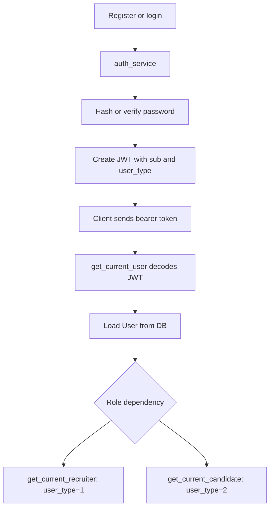

Current auth notes:

- Access tokens expire after 30 days.
- No refresh token flow.
- No password strength policy.
- No rate limiting.

## Authorization Model

Rules verified against current code:

- Candidate routes use `get_current_candidate`.
- Recruiter routes use `get_current_recruiter`.
- Candidate profile access checks `candidate.user_id == current_user.id`.
- Recruiter job management filters on `Job.recruiter_id == current_user.id`.
- Recruiter application listing verifies the job belongs to the recruiter.
- Candidate application listing resolves the authenticated user's candidate profile first.

Known authorization caveats:

- `GET /jobs/` and `GET /jobs/{job_id}` are public. `GET /jobs/{job_id}` returns `raw_jd` and parsed JD.
- `get_candidates()` still exists in `candidate_service.py` and returns all candidates if called internally. It is not exposed through a current route.

## Ownership Rules

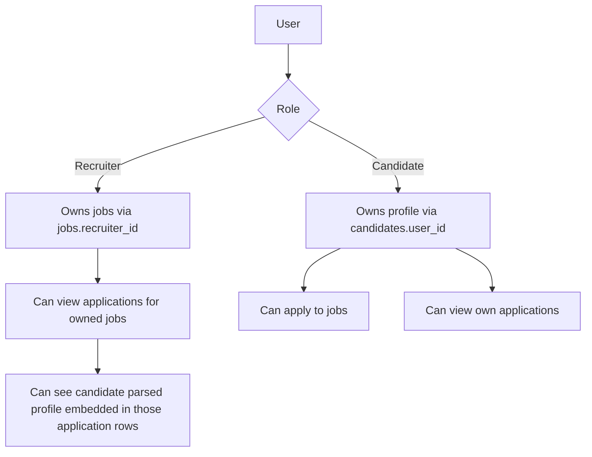

Candidate data visibility:

- Owning candidate can view their own profile.
- Recruiter can see candidate parsed profile only through applications for recruiter-owned jobs.
- Recruiter cannot browse all candidates.
- Recruiter cannot access random candidate profiles through `GET /candidates/{id}`.

Partial behavior:

- There is no dedicated recruiter candidate detail endpoint scoped by owned-job application relationship.
- Candidate can update profile only by re-uploading a resume; no manual edit endpoint exists.

## Candidate Pipeline

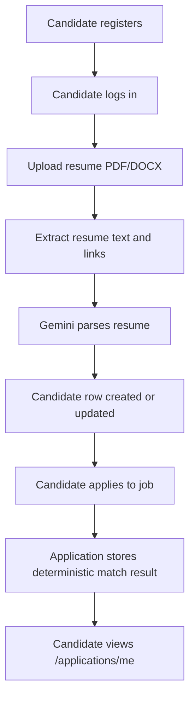

Current candidate endpoints:

- `POST /candidates/upload`
- `POST /candidates/github`
- `GET /candidates/me`
- `GET /candidates/`
- `GET /candidates/{candidate_id}`
- `DELETE /candidates/{candidate_id}`
- `POST /jobs/{job_id}/apply`
- `GET /applications/me`

## Recruiter Pipeline

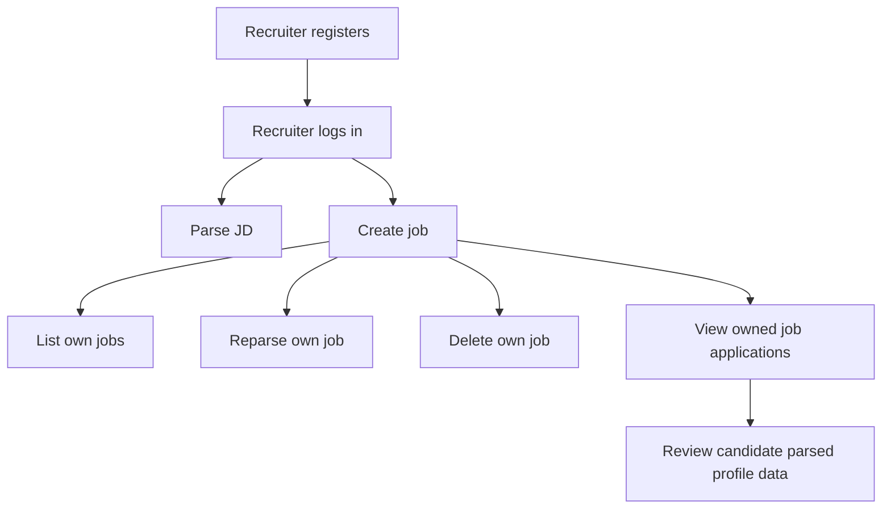

Current recruiter endpoints:

- `POST /jobs/parse`
- `POST /jobs/`
- `GET /jobs/my-jobs`
- `POST /jobs/{job_id}/reparse`
- `DELETE /jobs/{job_id}`
- `GET /jobs/{job_id}/applications`

## Resume Processing Flow

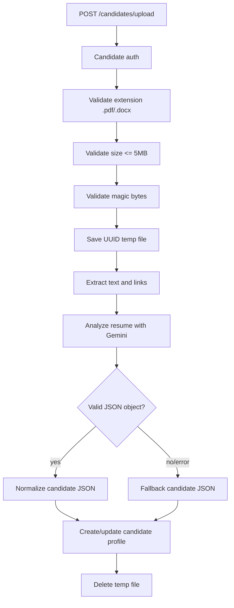

Current resume upload hardening:

- Does not store raw `resume.filename`.
- Generates UUID filenames.
- Allows `.pdf` and `.docx`.
- Enforces 5 MB max.
- Rejects empty files.
- Checks PDF/DOCX signatures.
- Cleans temp files on known failure paths.

## LinkedIn Processing Flow

Status: implemented for candidate-owned profiles.

MVP input format: PDF upload.

Required extraction targets:

- Headline.
- Positions.
- Education.
- Certifications.
- Skills.

Required implementation notes:

- Store structured LinkedIn output separately from resume data.
- Use `testprofile.pdf` as reference data. Current audit found it at backend root; it extracts as a 4-page LinkedIn profile for Ayush Pahuja with headline, summary, top skills, certifications, and experience content.
- Do not generate fake LinkedIn examples when the real reference PDF exists.

Expected future flow:

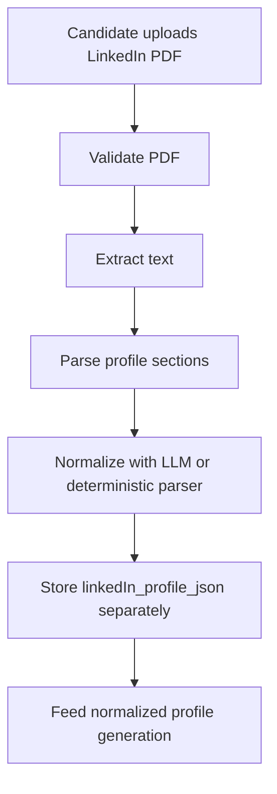

## GitHub Processing Flow

Status: pending.

Required input support:

- GitHub username.
- GitHub profile URL.
- GitHub repo URL.

Reference development account:

- `Lowdata`

Use real GitHub APIs and real response shapes whenever possible:

- `GET /users/{username}`
- `GET /users/{username}/repos`
- `GET /repos/{owner}/{repo}`
- `GET /repos/{owner}/{repo}/languages`
- `GET /repos/{owner}/{repo}/readme`
- `GET /users/{username}/events/public`

Current flow:

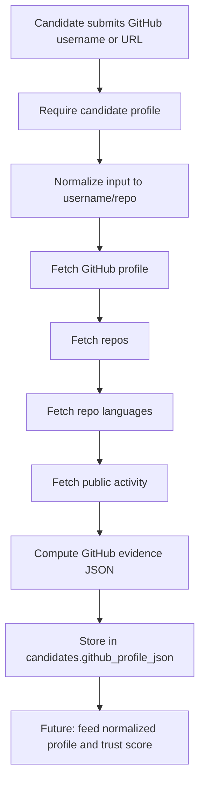

Implementation guardrails:

- Do not invent API response fields. The implementation maps real fields observed from `GET /users/Lowdata`, `GET /users/Lowdata/repos`, `GET /repos/{owner}/{repo}/languages`, and `GET /users/Lowdata/events/public`.
- Handle rate limits and unavailable data gracefully.
- Never require GitHub auth for public MVP analysis unless API limits demand it.

Current endpoint:

- `POST /candidates/github`
  - Auth: candidate.
  - Body examples:
    - `{"identifier": "Lowdata"}`
    - `{"identifier": "https://github.com/Lowdata"}`
    - `{"identifier": "https://github.com/Lowdata/CertiFit"}`
  - Requires an existing candidate profile.
  - Stores structured output in `candidates.github_profile_json`.

## Normalized Profile Generation

Status: pending.

Current state:

- Resume parsing produces `parsed_candidate_json`.
- There is no unified normalized profile that merges resume, LinkedIn, and GitHub.

Target MVP shape should merge evidence from:

- Resume profile.
- LinkedIn PDF profile.
- GitHub evidence from `candidates.github_profile_json`.

Expected future flow:

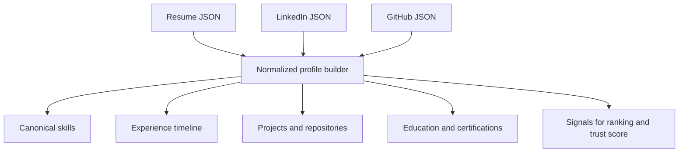

## Ranking Flow

Current status: implemented for resume/JD JSON.

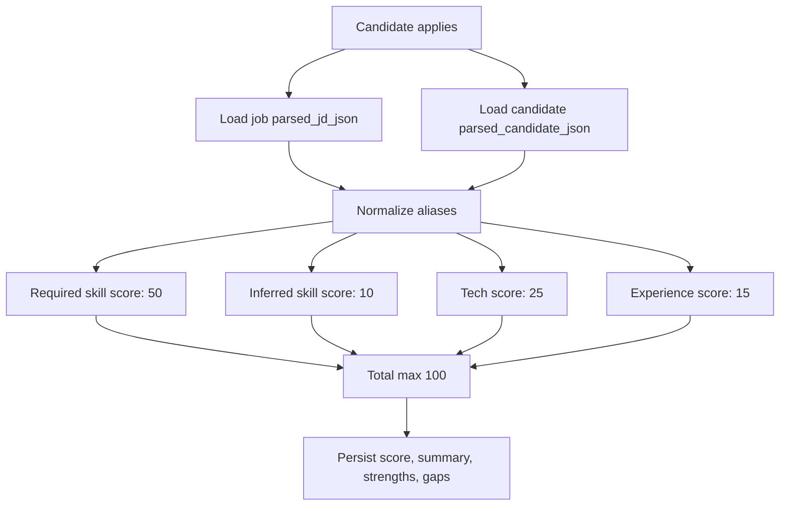

Current aliases:

- `Postgres` -> `PostgreSQL`
- `JS` -> `JavaScript`
- `Node` -> `Node.js`
- `React.js` -> `React`
- `TS` -> `TypeScript`

Future ranking should use normalized profile data once available, while staying deterministic for MVP.

## Trust Score Flow

Status: pending.

Audit result:

- No trust score model, service, schema, route, or tests were found.
- Do not assume trust scoring exists because candidate parsing has profile fields.

Expected future flow:

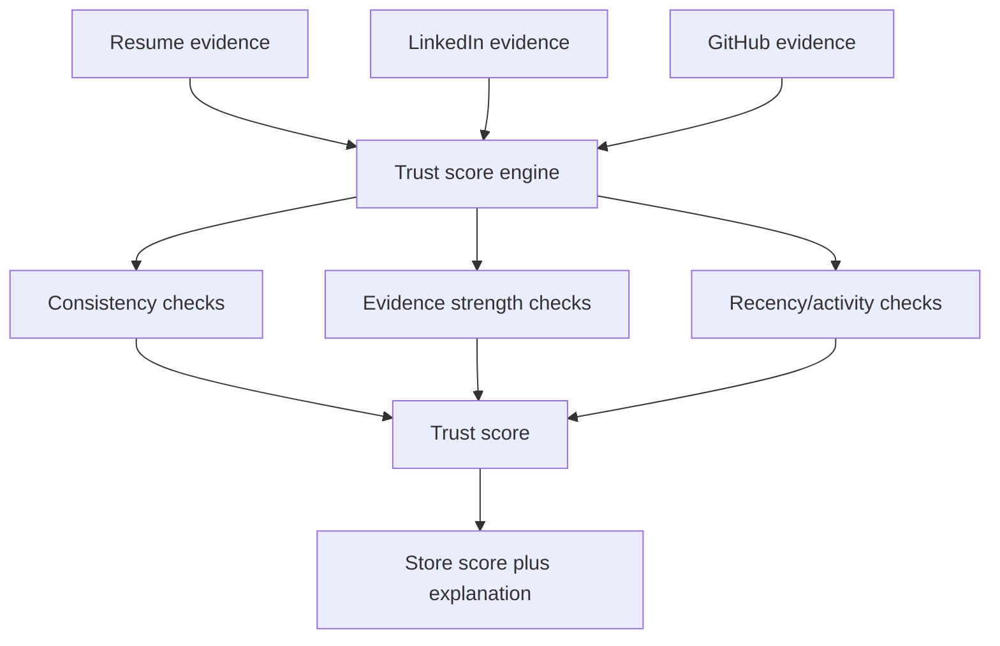

MVP trust score should be explainable and deterministic. Avoid black-box scoring without visible evidence.

## Interview Copilot Flow

Status: pending.

Current state:

- `app/api/interview.py` exists but is empty.
- No interview routes are registered in `app/main.py`.
- No interview models or services exist.

Expected future flow:

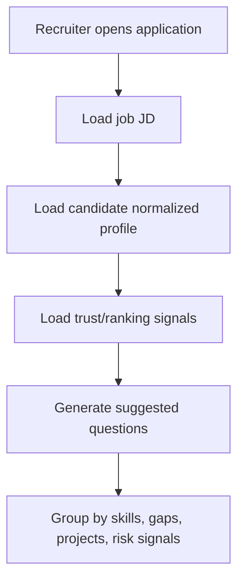

Keep this stateless for MVP unless persistence is explicitly needed.

## API Catalog

Route inventory from current app:

| Method | Path | Auth | Status |
| --- | --- | --- | --- |
| GET | `/health/` | Public | Implemented |
| POST | `/auth/register` | Public | Implemented |
| POST | `/auth/login` | Public | Implemented |
| GET | `/auth/me` | Bearer | Implemented |
| POST | `/jobs/parse` | Recruiter | Implemented |
| POST | `/jobs/` | Recruiter | Implemented |
| GET | `/jobs/my-jobs` | Recruiter | Implemented |
| GET | `/jobs/` | Public | Implemented |
| GET | `/jobs/{job_id}` | Public | Implemented |
| DELETE | `/jobs/{job_id}` | Recruiter owner | Implemented |
| POST | `/jobs/{job_id}/reparse` | Recruiter owner | Implemented |
| POST | `/jobs/{job_id}/apply` | Candidate | Implemented |
| GET | `/jobs/{job_id}/applications` | Recruiter owner | Implemented |
| POST | `/candidates/upload` | Candidate | Implemented |
| POST | `/candidates/github` | Candidate | Implemented |
| GET | `/candidates/me` | Candidate | Implemented |
| GET | `/candidates/` | Candidate | Implemented but odd; returns only own summary |
| GET | `/candidates/{candidate_id}` | Candidate owner | Implemented |
| DELETE | `/candidates/{candidate_id}` | Candidate owner | Implemented |
| GET | `/applications/me` | Candidate | Implemented |

Pending API areas:

- LinkedIn PDF ingestion endpoint.
- Normalized profile endpoint.
- Trust score endpoint or embedded profile field.
- Interview copilot endpoint.
- Application status update endpoint.
- Candidate manual profile update endpoint, if needed.

## Security Model

Current protections:

- JWT bearer authentication.
- Central recruiter/candidate role dependencies.
- Candidate ownership checks.
- Recruiter job ownership checks.
- Application visibility scoped to owned jobs.
- Upload path stripping and UUID storage names.
- Upload extension, size, and basic content validation.
- Error logging for critical parser/database failures.

Known production gaps:

- SQLAlchemy `echo=True` should be disabled in production.
- Token TTL is long.
- No refresh token/session revocation.
- No password policy.
- No rate limits.
- No CORS config.
- No malware scanning for uploads.
- No explicit data retention policy.
- No request-size limit at server/proxy level visible in repo.

## Migration Strategy

Alembic is the real migration flow.

Current migration chain:

- `0001_baseline`
- `0002_add_ownership`
- `0003_create_applications`
- `0004_add_candidate_github`

Operational notes:

- Use `alembic upgrade head` for shared DBs.
- Do not use `create.py` except for disposable local development.
- `0002_add_ownership` only backfills automatically if there is exactly one recruiter/candidate; otherwise it intentionally fails and requires manual ownership backfill.
- Existing DB upgrade path should be tested against staging Postgres before production.

## Test Coverage

Current test suite:

- Auth/privacy:
  - recruiter cannot list global candidates;
  - candidate can only read own profile;
  - recruiter can only view applications for owned jobs.
- Applications:
  - duplicate apply protection.
- Uploads:
  - unsupported type rejection;
  - generated filename;
  - parser failure API error.
- Parser/ranking:
  - fallback candidate shape;
  - LLM shape normalization;
  - technology alias normalization.
- GitHub:
  - username/profile URL/repo URL parsing;
  - candidate GitHub profile storage;
  - candidate profile required before GitHub ingestion.

Current verification commands:

```text
venv/bin/pytest -q
venv/bin/ruff check .
venv/bin/alembic heads
```

Recommended next tests:

- Recruiter cannot call `GET /candidates/{candidate_id}`.
- Candidate can view own applications end to end.
- Candidate cannot delete another candidate profile.
- Recruiter cannot delete/reparse another recruiter's job.
- Candidate cannot call recruiter-only routes.
- Recruiter cannot call candidate-only routes.
- Upload rejects oversized file.
- Upload rejects invalid PDF/DOCX magic bytes.
- GitHub API client tests using real response fixtures.
- LinkedIn PDF parser tests using `testprofile.pdf` when present.
- Normalized profile and trust score tests.

## Known Limitations

- `backend.md` was absent before this documentation pass; previous detailed audit existed as `docs/BACKEND_ARCHITECTURE.md`.
- `testprofile.pdf` exists at backend root as untracked reference data and should be used for LinkedIn parser validation unless the team decides to track or relocate it.
- GitHub ingestion exists, but it currently uses unauthenticated public API calls and does not persist raw API responses.
- Trust scoring is pending.
- LinkedIn ingestion is pending.
- Normalized profile generation is pending.
- Interview copilot is pending.
- Candidate manual profile editing is pending.
- Recruiter candidate detail endpoint scoped through application relationship is pending.
- Public job detail exposes raw JD and parsed JD.
- Empty placeholder API modules may confuse future agents.

## Future Roadmap

Recommended implementation order:

1. Add LinkedIn PDF ingestion using `testprofile.pdf` as the reference parser fixture/source.
2. Add normalized profile storage and generation.
3. Add deterministic trust score engine.
4. Update ranking to read normalized profile while preserving deterministic MVP behavior.
5. Add recruiter-scoped candidate detail endpoint if product requires it.
6. Add stateless interview copilot endpoint.
7. Harden production config, CORS, token/session policy, upload scanning, and CI.

Completed roadmap items:

- `backend.md` established as source of truth.
- GitHub input normalization, API client, candidate endpoint, storage, migration, and tests added.

## Current Audit Notes

Commands run during this audit:

```text
git status --short --branch
rg --files -g 'backend.md' -g 'BACKEND_ARCHITECTURE.md' -g '*.md'
rg -n "trust|github|linkedin|profile|interview|normalized|copilot" app tests docs .
find /Users/ayushpahuja/tests/certifit -maxdepth 6 -iname 'testprofile.pdf'
venv/bin/python - <<'PY'
import fitz
doc = fitz.open("testprofile.pdf")
print(doc.page_count)
doc.close()
PY
```

Findings:

- No committed or uncommitted `backend.md` existed.
- `testprofile.pdf` was found at backend root and can be parsed by PyMuPDF.
- Only GitHub/LinkedIn references are in resume parser output schema/fallback docs.
- No trust score implementation exists.
- No normalized profile implementation exists.
- No interview copilot implementation exists.
